# Excel 1주차 정규 과제 

📌Excel 정규과제는 매주 정해진 분량의 『*진짜 쓰는 실무 엑셀*』 을 읽고 학습하는 것입니다. 이번주는 아래의 **EXCEL_1st_TIL**에 나열된 분량을 읽고 공부하시면 됩니다.

아래의 문제를 풀어보며 학습 내용을 점검하세요. 문제를 해결하는 과정에서 개념을 스스로 정리하고, 필요한 경우 제시된 강의를 참고하여 보완하는 것이 좋습니다.

**교재 실습 예제 파일은 1주차 과제 설명 노션에 있습니다. 해당 파일을 다운 후 실습 진행해주시면 됩니다.**

**👀(수행 인증샷은 필수입니다.)** 

## EXCEL_1st_TIL

### 1장 시작부터 남다른 실무자의 엑셀 활용
#### 01. 엑셀 기본 설정 변경으로 맞춤 환경 만들기 (범위 제외)
#### 02. 엑셀 좀 사용하려면 반드시 알아야 할 엑셀 기본키 (범위 제외)
#### 03. 엑셀의 기본 동작 원리 이해하기
#### 04. 엑셀에서 발생하는 모든 오류와 해결 방법 총정리
#### 05. 실무자면 꼭 알아야 할, 필수 단축키 모음

### 2장 실무자라면 반드시 알아야 할 엑셀 활용
#### 01. 보기 좋은 표, 활용할 수 있는 데이터를 위한 필수 상식
#### 02. 편리한 엑셀 문서 작업을 위한 실력 다지기
#### 03. 엑셀로 시작하는 기초 데이터 분석
#### 02. 엑셀 데이터 가공을 위한 텍스트 나누고 합치기

## Study Schedule

| 주차  | 공부 범위     | 완료 여부 |
| ----- | ------------- | --------- |
| 1주차 | p.22~111    | ✅         |
| 2주차 | p.112~157   | 🍽️         |
| 3주차 | p.158~213  | 🍽️         |
| 4주차 | p.214~273 | 🍽️         |
| 5주차 | p.274~339 | 🍽️         |
| 6주차 | p.340~425 | 🍽️         |
| 7주차 | p.426~472 | 🍽️         |

 

<!-- 여기까진 그대로 둬 주세요-->

---

# 1️⃣ 학습 내용 정리

## 01-3. 엑셀의 기본 동작 원리 이해하기
> **셀 참조 방식에 대해 정리해주세요.**

1) **상대참조**: 다른 셀을 참조할 때 셀 주소앞에 $ 기호가 전혀 포함 x
2) 절대참조: 열과 행에 모두 $를 붙인 형태
- 수식을 복사, 자동채우기를 실행해도 셀 주소는 고정
- $F$5*E6: 상대참조부분 E6만 위치에 따라 자동채우기 실행
3) 혼합참조: 행, 열 중에 하나만 고정
- C$4*$B5: C4 -> D4 -> E4 ... / B5 -> B6 -> B7...

## 01-4. 엑셀에서 발생하는 모든 오류와 해결 방법 총정리
> **숫자처럼 보이는 문자를 빠르게 확인하고 해결하기(51 ~52p)를 진행 후 인증사진을 첨부해주세요.**
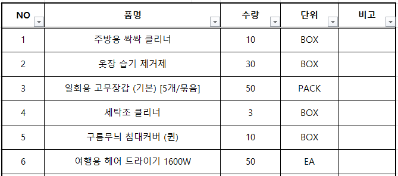
- 홈 탭 - 편집 - 찾기및선택 - 이동옵션: 상수, 텍스트 선택시 해당 셀만 확인가능
  - 1을 선택하여 붙여넣기하여 숫자로 바꾸기
  - 수식 - 수식분석 - 오류검사 

## 01-5. 실무자면 꼭 알아야 할, 필수 단축키 모음
> **이번에 배운 단축키에 대해 정리해주세요.**
### ctrl, alt
1) ctrl: 다른 키랑 동시에 누름
2) alt: 다른 키랑 순서대로 누름

#### ▶ 파일 관리 작업 단축키
- ctrl + s: 파일저장
- ctrl + F11: 새로운 시트 추가 
- ctrl + N: 새로운 통합문서 만들기
- ctrl + (shift) + pageup/pagedown
   - ctrl + pageup: 이전 시트로
   - ctrl + pagedown: 다음 시트로 
   - ctrl + shift + pageup/pagedown: 연속된 시트 다중선택
- ctrl + 마우스휠: 배율 조절
- alt-p-r-s: 인쇄 영역 설정 
    - ctrl + p: 인쇄 미리보기

#### ▶ 엑셀 작업
- ctrl + shift + U: 수식 입력줄 확장
- **alt - W - F - F**: 기준 행/열 머리글 선택 후 누르면 **틀 고정**
- **ctrl + shift + L**: 자동 **필터 적용**
- ctrl + [, ctrl + ]: 현재 셀의 수식에 참조되는 셀 / 현재 셀을 참조하는 셀 확인
   -> *"수식 - 수식분석 - 참조되는 셀추적"으로 확인*

#### ▶ 자료 편집 작업
- **alt + enter**: 셀 내 줄바꿈
- ctrl + alt + V: 선택하여 붙여넣기
- ctrl + F: 찾기
- ctrl + H: 바꾸기
- **F4**: 이전 작업 반복
- ctrl + z/y: 이전/다시 실행
- ctrl + enter: 선택 범위에 동일한 값/수식 입력

##### 📌 특정 서식 빠르게 적용
 셀에 입력된 값 -> 천 단위 숫자, %가 붙은 백분율로 빠른 변경

| 단축키 | 적용 서식 |
| :--- | :--- |
| `Ctrl` + `Shift` + `~` | 일반 서식(예: 1000) |
| `Ctrl` + `Shift` + `1` (`!`) | 숫자 서식(예: 1000 → 1,000) |
| `Ctrl` + `Shift` + `2` (`@`) | 시간 서식(예: 08:30, 09:15) |
| `Ctrl` + `Shift` + `3` (`#`) | 날짜 서식(예: 2020-03-09) |
| `Ctrl` + `Shift` + `4` (`$`) | 통화 서식(예: 1000 → ₩1,000) |
| `Ctrl` + `Shift` + `5` (`%`) | 백분율 서식(예: 0.1 → 10%) |
| `Ctrl` + `Shift` + `6` (`^`) | 지수 서식(예: 1000 → 1.00E+03) |

#### ▶ 셀 이동, 선택
- ctrl + 방향키: 이동
- **ctrl + shift + 방향키**: 표의 끝까지 선택
- ctrl + backspace: 현재 활성화된 셀로 이동
- ctrl + **Home**, ctrl + **end**: 처음/마지막 셀로 이동
- ctrl/shift + space: 행/열 전체 선택
- **alt + shift + -> / <-: 선택한 범위를 그룹으로 묶기/풀기

##### 📌 자주 사용하는 이동 옵션 4가지

* **진입 경로**: `이동` 대화상자 → `[옵션]` 버튼 클릭

* **핵심 기능**:
  1. **메모로 이동**: `[메모]` 선택 → 메모가 표시된 셀로 이동
  2. **숫자형 문자 찾기**: `[상수]` 선택 + `[텍스트]` 체크 → 문자 형태의 숫자 검색
  3. **오류 셀 이동**: `[수식]` 선택 + `[오류]` 체크 → 오류 발생 셀 검색
  4. **빈 셀 이동**: `[빈 셀]` 선택 → 표 내부의 빈 셀로 이동

## 02-1. 보기 좋은 표, 활용할 수 있는 데이터를 위한 필수 상식
> **데이터와 표를 비교해주세요**
표: 보기좋게 시각화된 서식
  -> 무분별하게 데이터를 표로 정렬할 시 문제 발생

1) 데이터 정렬, 특정값을 찾아야할 때
- 표: 함수(max, large 등 이용) 
  데이터: 필터를 이용하여 데이터 정렬 후 순위 확인

2) 새로운 데이터 누적 시 
- 기존 정보를 변경/삭제할 때 (직원변동) 중간이 비게 됨

3) 새로운 구분자를 추가할 때
- '주거방식' 구분자를 추가한다면 행? 열? 추가방식에 따라 수정해야함

> **셀 병합 기능을 자제해야 하는 이유를 정리해주세요.**
셀 병합 -> 첫번째 셀값만 남음
- 범위 선택 제한
- 범위의 수정/편집 제한
- 표 기능, 피벗 테이블 사용 제한
- 자동 채우기 제한
- 데이터 정렬기능 제한
- 함수 사용시 오류 반환

## 02-2. 편리한 엑셀 문서 작업을 위한 실력 다지기
> **셀 병합하지 않고 가운데 정렬하(75 ~77p)를 진행 후 인증사진을 첨부해주세요.**
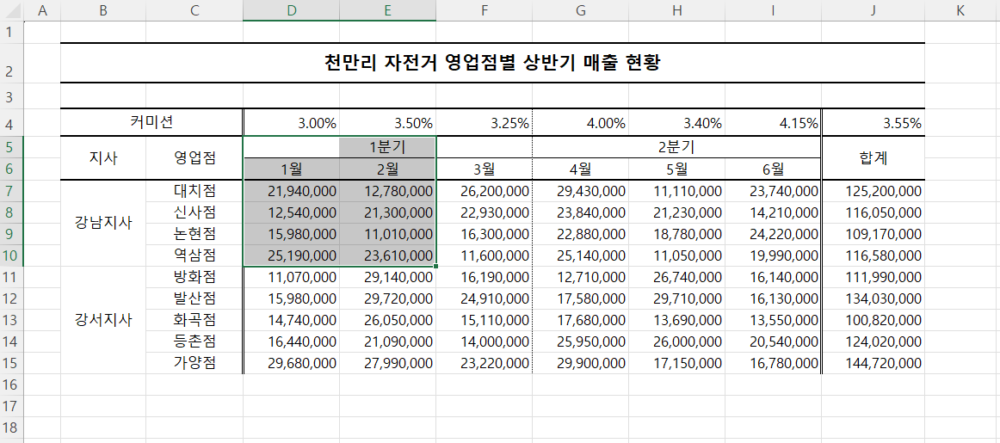
- 셀 병합 대신 제목 가운데로 오게 하는 방법
   
   : 셀 선택해서 **우클릭 -> 맞춤 -> 가로:선택 영역의 가운데로** 

> **셀 병합 해제 후 빈칸 쉽게 체우기(78 ~79p)를 진행 후 인증사진을 첨부해주세요.**
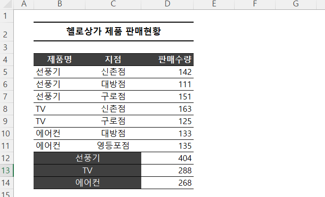

> **빈 셀을 한 번에 찾고 내용 입력하기(80 ~81p)를 진행 후 인증사진을 첨부해주세요.**
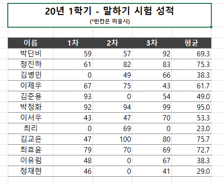
- 찾기 및 이동 -> 이동옵션 -> 빈셀: 빈셀 한번에 찾을 수 있음
- 선택된 상태에서 그대로 0 입력 -> **ctrl + enter**

> **숫자 데이터의 기본 단위를 한 번에 바꾸는 방법(84 ~87p)를 진행 후 인증사진을 첨부해주세요.**
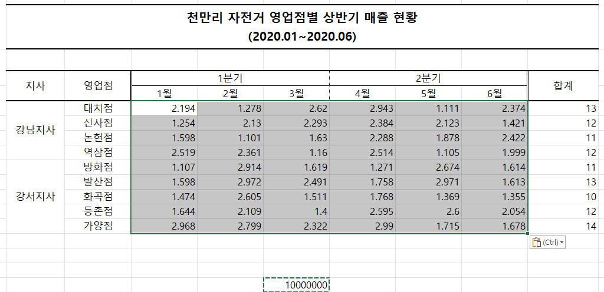
-*나눌 수 입력, 복사 -> **선택하여 붙여넣기 -> 나누기**
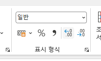
- **홈 -> 표시형식 -> 자릿수 늘림**으로 소수점 한자리까지 표시
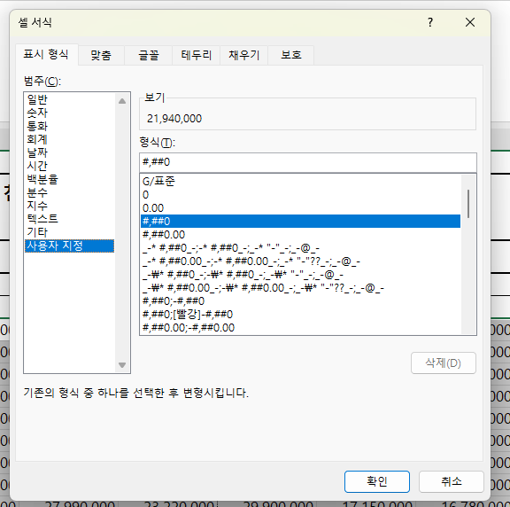
- 셀 형식 변환

## 02-3. 엑셀로 시작하는 기초 데이터 분석
> **행/열 전환하여 새로운 관점으로 데이터 살펴보기(88 ~90p)를 진행 후 인증사진을 첨부해주세요.**
- 표 전체 드래그 **선택하여 붙여넣기**

  -> **'값 및 숫자 서식','행/열 바꿈** 선택

  -> 홈-셀-서식-**열너비 자동맞춤**

- 필터적용: ctrl + shift + L
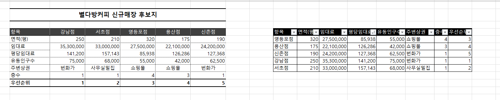

> **중복된 데이터 입력 제한하기(90 ~92p)를 진행 후 인증사진을 첨부해주세요.**
1) 오류메세지 출력하는 방법
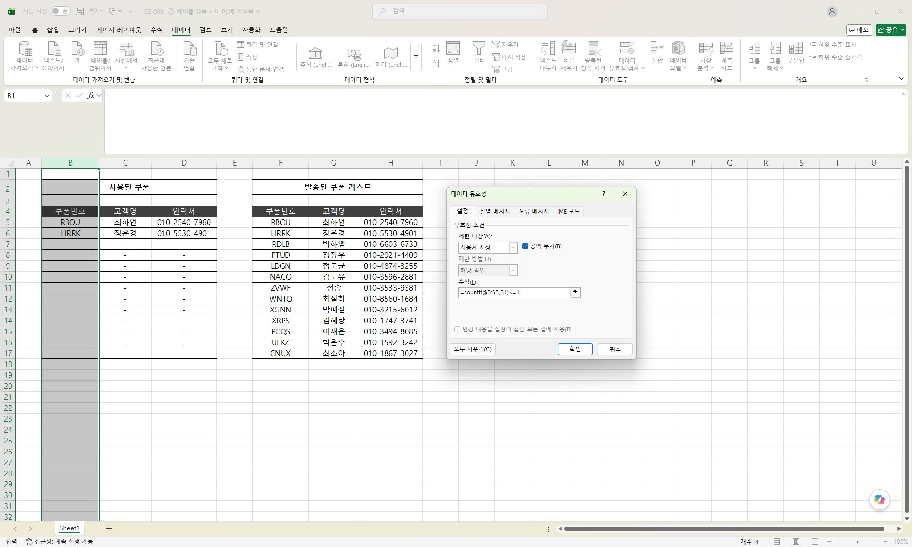
- 데이터-데이터도구-데이터유효성 검사-사용자지정
- =COUNTIF($B:$B,B1)<=1 
   
   -> B열 전체에서 B1이랑 값이 같은 셀의 개수가 1개 이하이면 TRUE
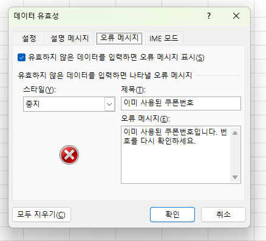
- 오류메세지도 넣어주기

**결과**
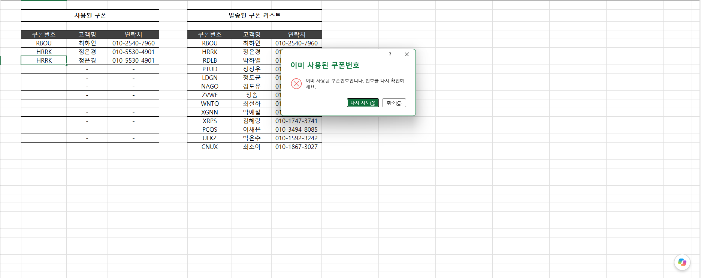

## 02-4. 엑셀 데이터 가공을 위한 텍스트 나누고 합치기
> **여러 줄을 한 줄로 합치거나 한 줄을 여러 줄로 분리하기(104 ~107p)를 진행 후 인증사진을 첨부해주세요.**
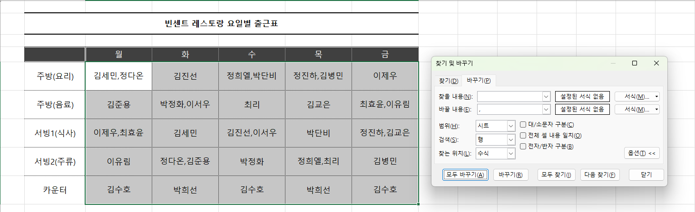
- 찾을 내용: **ctrl + J** (줄바꿈)
- 바꿀 내용: 쉼표(,)
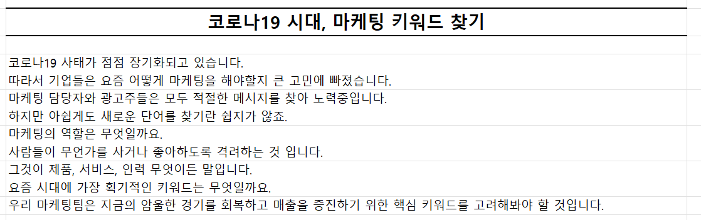
- 찾을 내용: **. + spacebar**
- 바꿀 내용: **. + ctrl + J**

> **여러 열에 입력된 내용을 간단하게 한 열로 합치기(108 ~109p)를 진행 후 인증사진을 첨부해주세요.**
- 그대로 워드로 옮겨서 **표 레이아웃-텍스트변환-단락기호** 선택
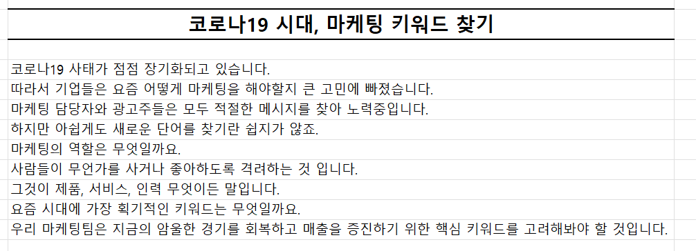

---

### 🎉 수고하셨습니다.

