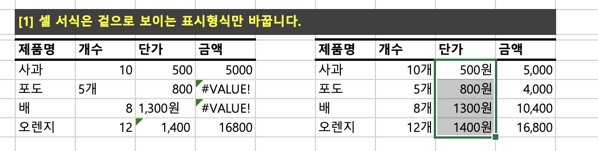
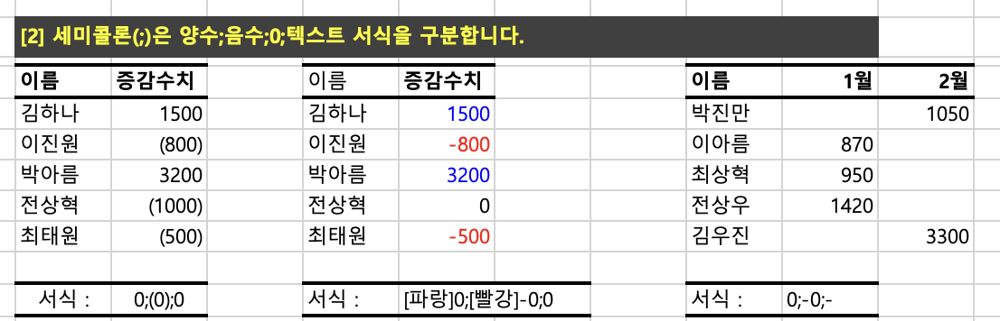
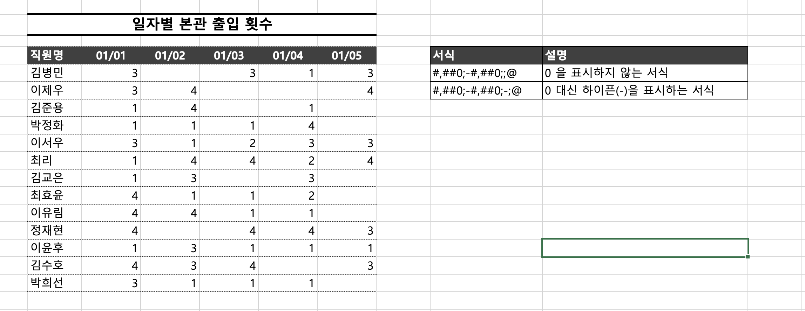
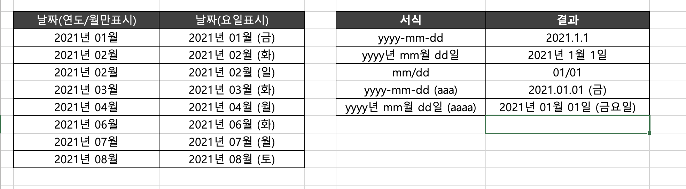
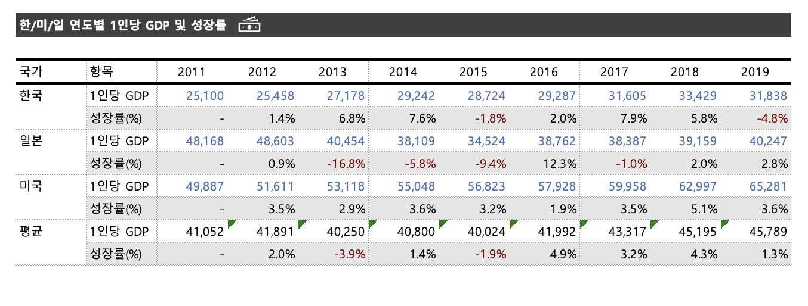
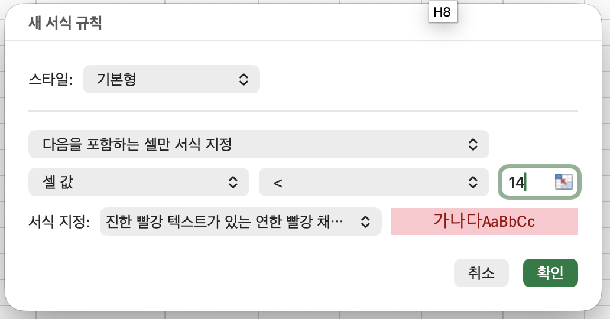
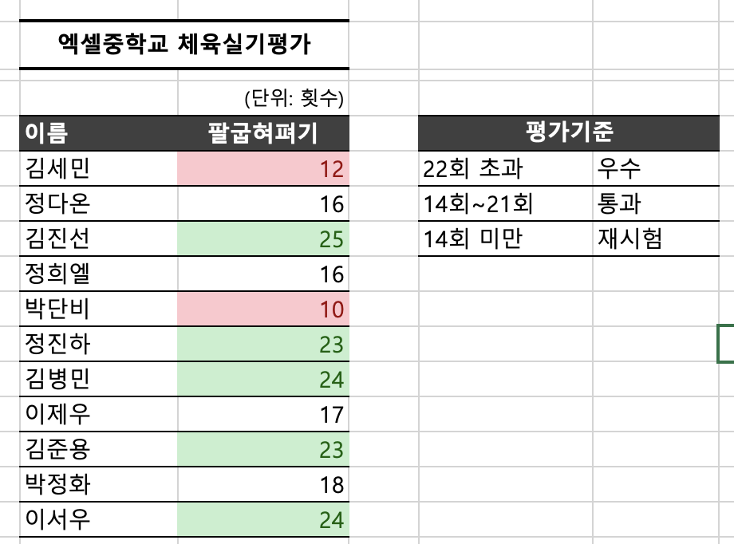
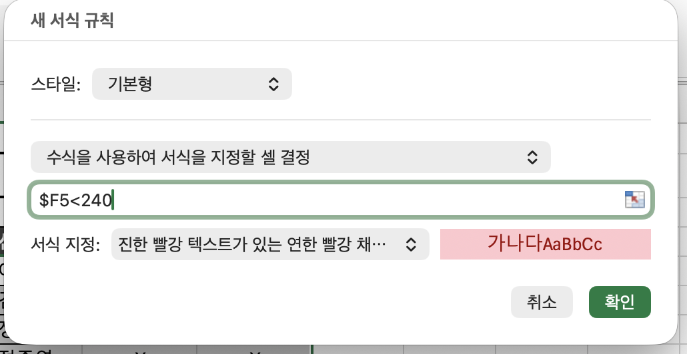
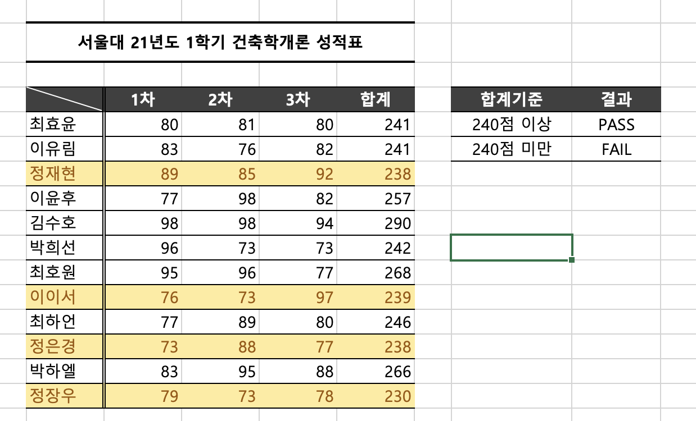
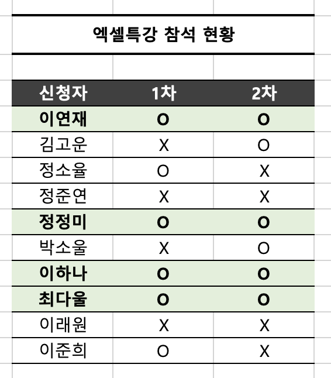

# Excel 2주차 정규 과제 

📌Excel 정규과제는 매주 정해진 분량의 『*진짜 쓰는 실무 엑셀*』 을 읽고 학습하는 것입니다. 이번주는 아래의 **EXCEL_2nd_TIL**에 나열된 분량을 읽고 공부하시면 됩니다.

아래의 문제를 풀어보며 학습 내용을 점검하세요. 문제를 해결하는 과정에서 개념을 스스로 정리하고, 필요한 경우 제시된 강의를 참고하여 보완하는 것이 좋습니다.

**교재 실습 예제 파일은 1주차 과제 설명 노션에 있습니다. 해당 파일을 다운 후 실습 진행해주시면 됩니다.**

**👀(수행 인증샷은 필수입니다.)** 

## EXCEL_2nd_TIL

### 3장 보고서가 달라지는 서식 활용법
#### 01. 반드시 숙지해야 할 셀 서식 기초
#### 02. 실무자를 위한 셀 표시 형식 대표 예제
#### 03. 깔끔한 보고서 작성을 위한 기본 규칙
#### 04. 조건부 서식으로 빠르게 데이터 분석하기
#### 05. 데이터 이해를 돕는 시각화 요소 추가하기 (범위 제외)

## Study Schedule

| 주차  | 공부 범위     | 완료 여부 |
| ----- | ------------- | --------- |
| 1주차 | p.22~111    | ✅         |
| 2주차 | p.112~157   | ✅         |
| 3주차 | p.158~213  | 🍽️         |
| 4주차 | p.214~273 | 🍽️         |
| 5주차 | p.274~339 | 🍽️         |
| 6주차 | p.340~425 | 🍽️         |
| 7주차 | p.426~472 | 🍽️         |

 

<!-- 여기까진 그대로 둬 주세요-->

---

# 1️⃣ 학습 내용 정리

## 03-1. 반드시 숙지해야 할 셀 서식 기초
> **표시 형식은 걸으로 보이는 형식만 바꾼다(113 ~ 115p)를 진행 후 인증사진을 첨부해주세요.**
- 셀서식: Ctrl + 1

> **세미콜론으로 양수, 음수, 0, 텍스트 서식을 구분한다(115 ~ 117p)를 진행 후 인증사진을 첨부해주세요.**

- 셀 서식 - 사용자 - 0;(0);0
   
   => 음수에 괄호가 씌워져서 (800) 
- [파랑]0;[빨강]-0;0
 
   => 양수(0;)는 파랑, 음수는 빨강(-0;0)

## 03-2. 실무자를 위한 셀 표시 형식 대표 예제
> **0 지우거나 하이픈[-]으로 표시하기(119 ~121p)를 진행 후 인증사진을 첨부해주세요.**

> **날짜를 년/월/일 [요일]로 표시하기(121 ~122p)를 진행 후 인증사진을 첨부해주세요.**

## 03-3. 깔끔한 보고서 작성을 위한 기본 규칙
> **깔끔한 보고서 완성하기(131 ~134p)를 진행 후 인증사진을 첨부해주세요.**

## 03-4. 조건부 서식으로 빠르게 데이터 분석하기
> **특정 값보다 크거나 작을 때 강조하기(137 ~139p)를 진행 후 인증사진을 첨부해주세요.**

- 홈 - 조건부서식

> **조건을 만족할 때 전체 행 강조하기(141 ~142p)를 진행 후 인증사진을 첨부해주세요.**

> **여러 조건에 모두 만족하는 셀 강조하기(143 ~144p)를 진행 후 인증사진을 첨부해주세요.**

= AND($C5="O", $D5="O")

---

### 🎉 수고하셨습니다.

