# Excel 3주차 정규 과제 

📌Excel 정규과제는 매주 정해진 분량의 『*진짜 쓰는 실무 엑셀*』 을 읽고 학습하는 것입니다. 이번주는 아래의 **EXCEL_3rd_TIL**에 나열된 분량을 읽고 공부하시면 됩니다.

아래의 문제를 풀어보며 학습 내용을 점검하세요. 문제를 해결하는 과정에서 개념을 스스로 정리하고, 필요한 경우 제시된 강의를 참고하여 보완하는 것이 좋습니다.

**교재 실습 예제 파일은 1주차 과제 설명 노션에 있습니다. 해당 파일을 다운 후 실습 진행해주시면 됩니다.**

**👀(수행 인증샷은 필수입니다.)** 

## EXCEL_3rd_TIL

### 4장 완성한 엑셀 보고서 공유 및 출력하기
#### 01. 1분 투자로 100점짜리 보고서 완성하기
#### 02. 외부 통합 문서 참조할 때 발생하는 오류 처리하기
#### 03. 외부 공유를 대비하여 정보를 관리하자 (범위 제외)
#### 04. 엑셀 파일 크기를 절반으로 줄이는 방법 3가지 (범위 제외)
#### 05. 엑셀은 보안 측면에서 완벽한 프로그램이 아니다
#### 06. 실무자가 반드시 알아야 할 인쇄 설정 기본
#### 07. 여러 페이지 보고서를 인쇄할 때 확인 사항
#### 08. 엑셀 문서를 PDF로 변환하는 가장 쉬운 방법 (범위 제외)

## Study Schedule

| 주차  | 공부 범위     | 완료 여부 |
| ----- | ------------- | --------- |
| 1주차 | p.22~111    | ✅         |
| 2주차 | p.112~157   | ✅         |
| 3주차 | p.158~213  | ✅         |
| 4주차 | p.214~273 | 🍽️         |
| 5주차 | p.274~339 | 🍽️         |
| 6주차 | p.340~425 | 🍽️         |
| 7주차 | p.426~472 | 🍽️         |

 

<!-- 여기까진 그대로 둬 주세요-->

---

# 1️⃣ 학습 내용 정리

## 04-1. 1분 투자로 100점짜리 보고서 완성하기
> **입력하는 값 & 계산되는 값 구분하기(162 ~ 163p)를 진행 후 인증사진을 첨부해주세요.**
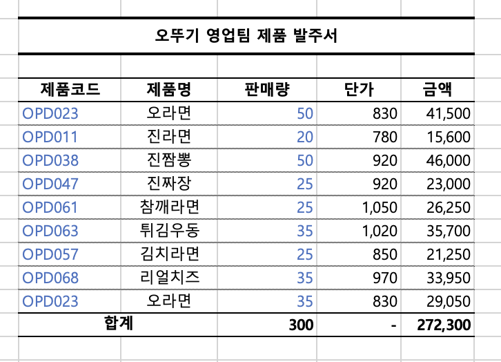
홈 - 찾기 - 이동옵션 - 옵션: 상수 
    -> 수식이 입력된 셀, 빈 셀을 제외하고 직접 입력된 셀들이 선택

## 04-2. 외부 통합 문서 참조할 때 발생하는 오류 처리하기
> **외부 데이터 원본에 대한 연결 오류 해결하기(166 ~167p)를 진행 후 인증사진을 첨부해주세요.**
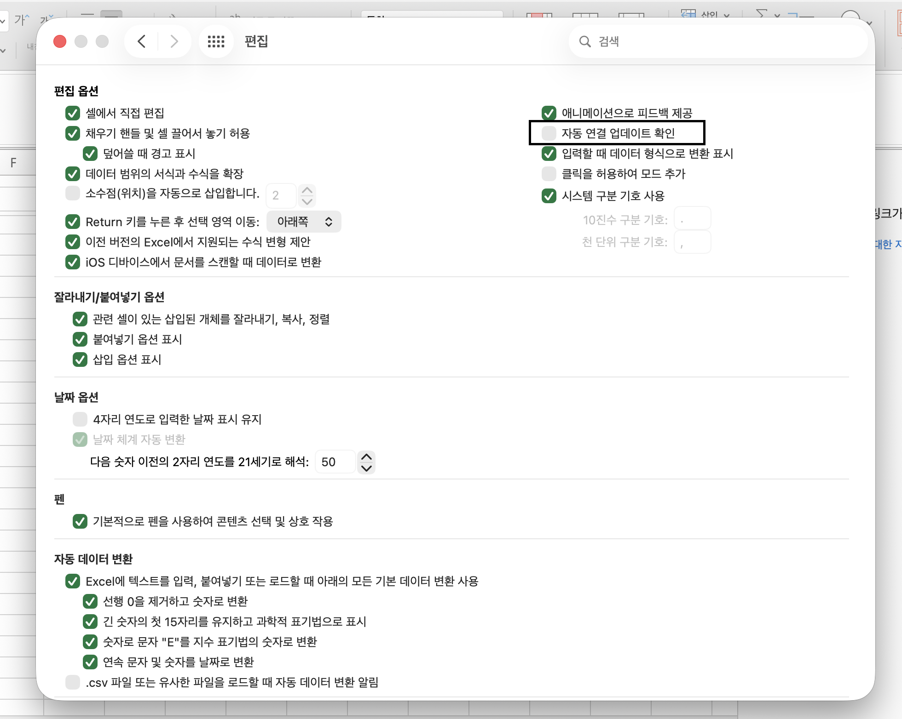

## 04-5. 엑셀은 보안 측면에서 완벽한 프로그램이 아니다
> **데이터 유효성 검사로 입력할 데이터 제한하기(179 ~183p)를 진행 후 인증사진을 첨부해주세요.**
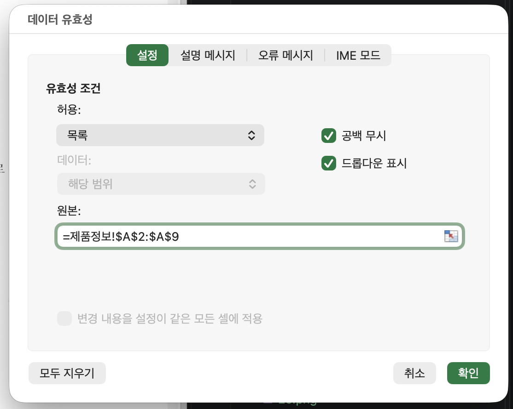
- 데이터 유효성 검사 - **허용: 목록** - 원본: **=제품정보!$A$2:$A$9** 입력
    - 목록에 없는 항목은 걸러짐
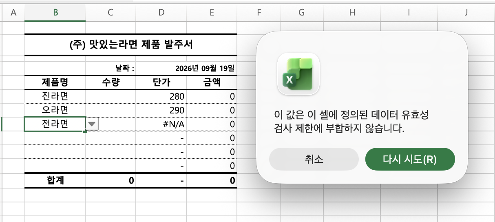

- 데이터 유효성 검사 - **허용:정수** - 최댓/최솟값 설정 - 오류메시지 입력
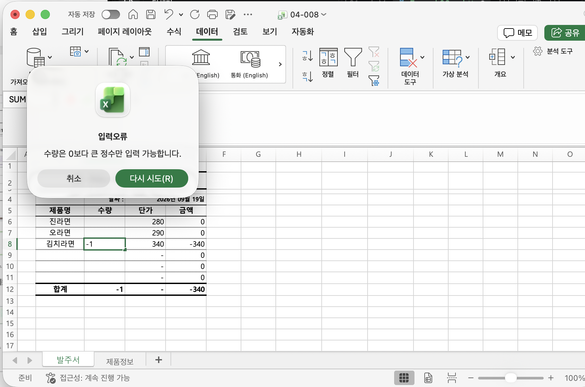
최댓/최솟값을 넘어선 정수가 입력될 시에 지정한 오류메시지가 뜸

### 📌 데이터 유효성 검사의 제한 대상[cite: 6]

| 제한 대상 | 설명 |
| :--- | :--- |
| **정수** | 최솟값과 최댓값을 지정하여 정수만 입력할 수 있습니다. |
| **소수점** | 최솟값과 최댓값을 지정하여 소수만 입력할 수 있습니다. |
| **목록** | 원본으로 설정한 목록만 입력할 수 있습니다. (특정 범위 지정 또는 쉼표(,)로 직접 입력 가능. 예: `사과,배,포도`) |
| **날짜** | 시작 날짜와 끝 날짜를 지정하여 해당 범위의 날짜만 입력할 수 있습니다. |
| **시간** | 시작 시간과 종료 시간을 지정하여 해당 범위의 시간만 입력할 수 있습니다. |
| **텍스트 길이** | 최솟값과 최댓값을 지정하여 정해진 길이의 텍스트를 입력할 수 있습니다. |
| **사용자 지정** | 수식을 입력하여 조건에 만족하는 값만 입력할 수 있습니다. • 예) '가'로 시작하는 텍스트만 허용: `=LEFT(셀 주소, 1)="가"` |

> **시트 내용을 수정하지 못하도록 보호하기(186 ~190p)를 진행 후 인증사진을 첨부해주세요.**
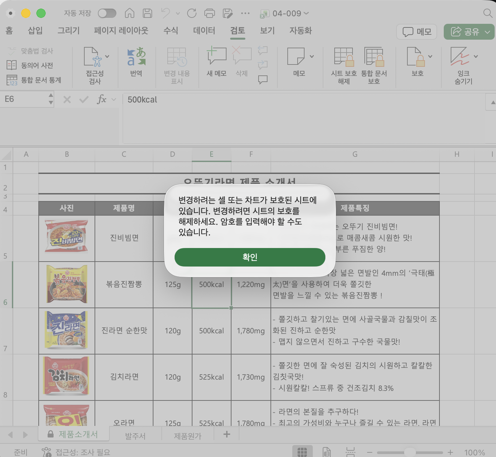
- 검토 - 보호 - 시트보호 - 비번 입력
    -> 내용을 수정하려고하면 오류메세지 뜸
- 시트 보호를 적용할 때, 특정 기능들을 선택해서 보호하면서도 수정하게 할 수 있음
### 🔒 시트 보호 중 특정 기능 사용 허용하기[cite: 7]

* **개요**: 셀 편집은 제한하되 자동 필터, 개체 편집 등 필요 기능만 선택적으로 허용하는 설정임[cite: 7]
* **설정 방법**: `시트 보호` 대화상자 → 암호 입력 → `허용할 내용` 목록 체크 → `[확인]`[cite: 7]

#### 💡 주요 허용 가능 기능[cite: 7]

| 허용할 기능 | 핵심 설명 |
| :--- | :--- |
| **잠긴 셀 / 잠기지 않은 셀 선택** | 셀 선택 허용 (체크 해제 시 눈으로만 확인 가능함) |
| **셀 / 열 / 행 서식** | 셀 및 행/열 전체의 서식 변경을 허용함 |
| **열 / 행 삽입·삭제** | 행 또는 열의 삽입 및 삭제를 허용함 |
| **하이퍼링크 삽입** | 잠금 해제된 셀에 하이퍼링크 삽입을 허용함 |
| **정렬, 자동 필터 사용** | 데이터 정렬 및 자동 필터 기능 사용 허용 (실무 자주 사용) |
| **피벗 테이블 및 피벗 차트 사용** | 기존 피벗 테이블/차트 사용 허용 (신규 추가는 불가함) |
| **개체 편집** | 도형, 슬라이서 등 개체 조작 허용 (대시보드 작성 시 활용) |
| **시나리오 편집** | 목표값 찾기 등의 시나리오 편집을 허용함 |

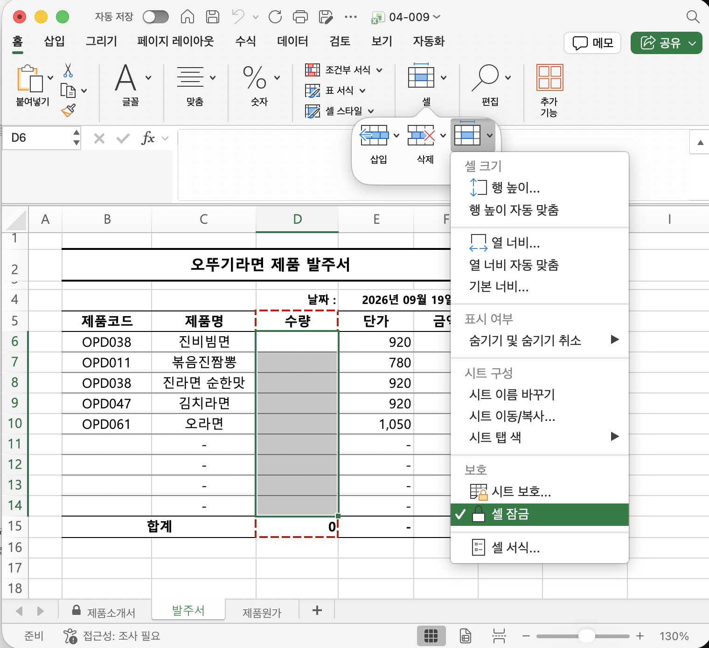
- 홈 - 셀 - 셀기능 - 셀잠금
- 검토 - 보호 - 시트보호 - ✅잠긴셀선택/잠금해제된셀선택
    -> 표시 부분(셀잠금)만 수정 가능 

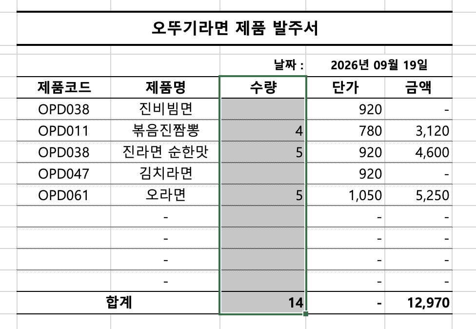

## 04-6. 실무자가 반드시 알아야 할 인쇄 설정 기본
> **해당 내용(194 ~199p)를 진행 후 인증사진을 첨부해주세요.**

- ctrl+p: 인쇄 미리보기
    -> 불필요한 내용, 잘리는 내용 등 확인
- 특정 부분을 인쇄범위에 포함하려면
    - 해당 부분 드래그 - 페이지 레이아웃 - 인쇄영역 - 인쇄영역 설정
    - 그럼 인쇄영역으로 포함됨

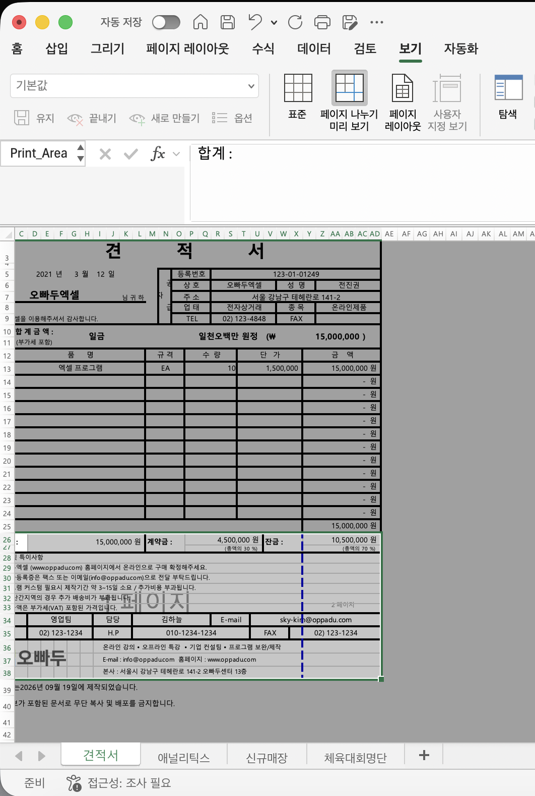
- 보기 - 페이지 나누기 미리보기 - **파란실선을 옮기며** 인쇄 영역 설정
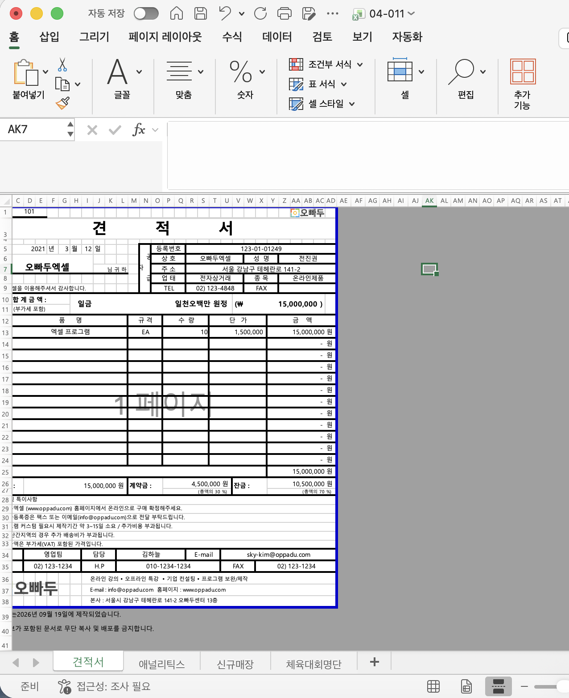
--- 
#### 인쇄파트
- ctrl+P
    - 한페이지에 모든 열 맞추기
    - 문서 특성에 따라 가로/세로 방향 설정
    - 보통 여백 -> 사용자 지정 여백 -> 자료를 보기 좋은 정도로 여백 설정
    - **표가 한쪽으로 쏠려있는 경우**
        **-> 여백 - 가로/세로 옵션 ✔︎**

## 04-7. 여러 페이지 보고서를 인쇄할 때 확인 사항
> **해당 내용(200 ~207p)를 진행 후 인증사진을 첨부해주세요.**
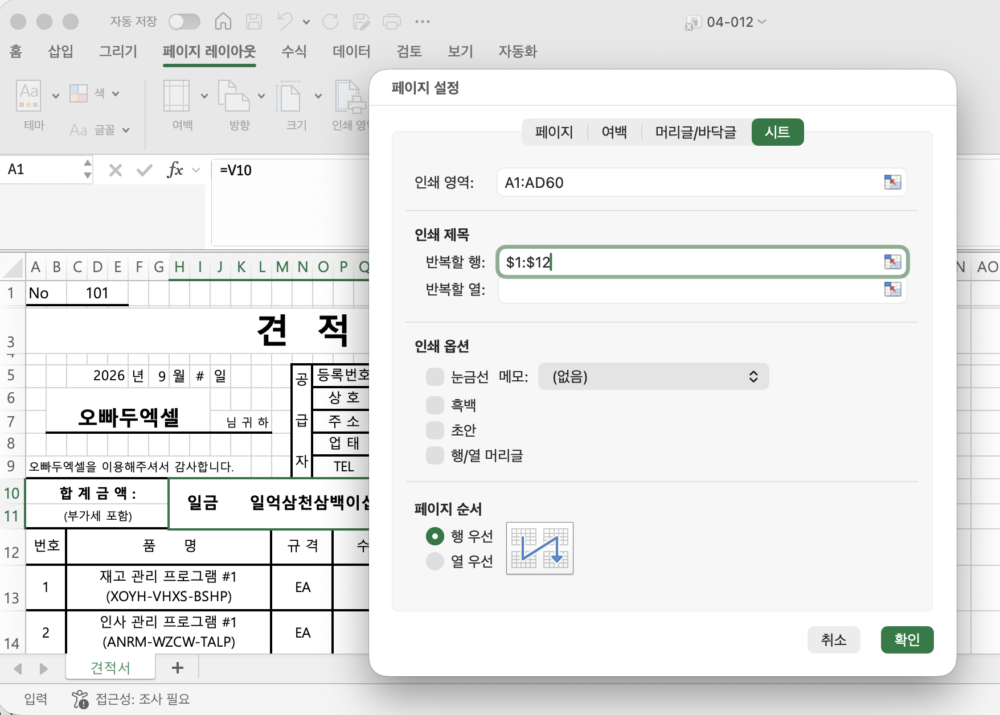
- 페이지 레이아웃 - 페이지 설정 - 인쇄 제목 - 시트 - **반복할행: $1:$12 (위에 뜨게 할 행)**
- $12:$12 로 하면 좀 더 깔끔하게 표의 윗부분만 반복해서 들어가게 할 수 있음

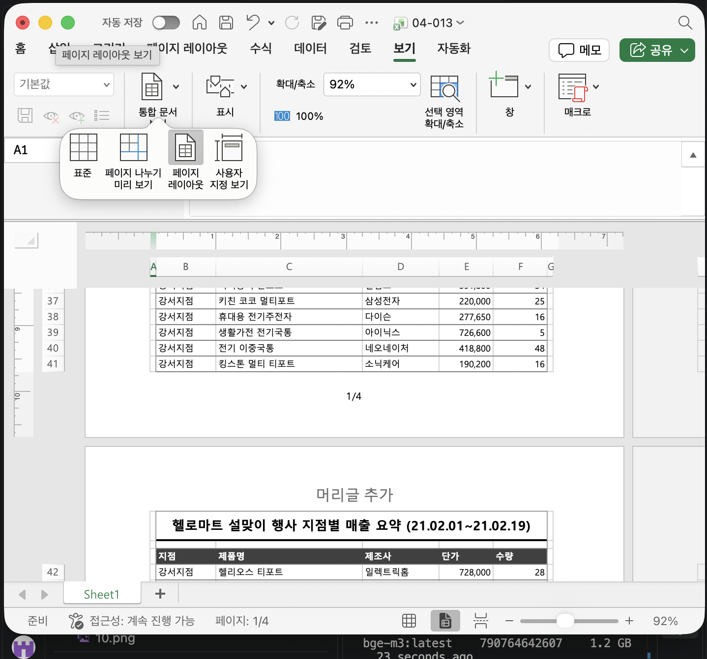
- 보기 - 페이지레이아웃 - 바닥글 선택 
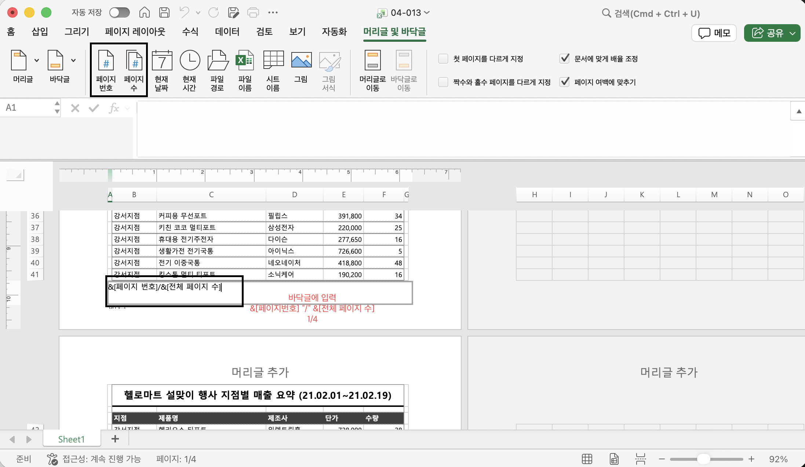

### 📄 머리글이나 바닥글 활용하기[cite: 8]

* **기능 개요**: 각각 3개 영역으로 구성되며, 입력 시 모든 페이지에 반복 인쇄됨[cite: 8]
* **설정 방법**: `페이지 레이아웃 보기` 모드 → 머리글/바닥글 영역 클릭 → 텍스트 입력[cite: 8]
* **자동 요소 활용**:
  * `[머리글/바닥글 요소]` 그룹 사용 시 편리함[cite: 8]
  * `[현재 날짜]` 클릭 시 `&[날짜]` 입력, `[현재 시간]` 클릭 시 `&[시간]` 입력됨[cite: 8]
  * 인쇄 시 현재 날짜 및 시간이 자동으로 표시됨[cite: 8]
* **주의 사항**: 프린터 사양에 따라 여백이 좁으면 바닥글이 잘려 인쇄될 수 있음[cite: 8]

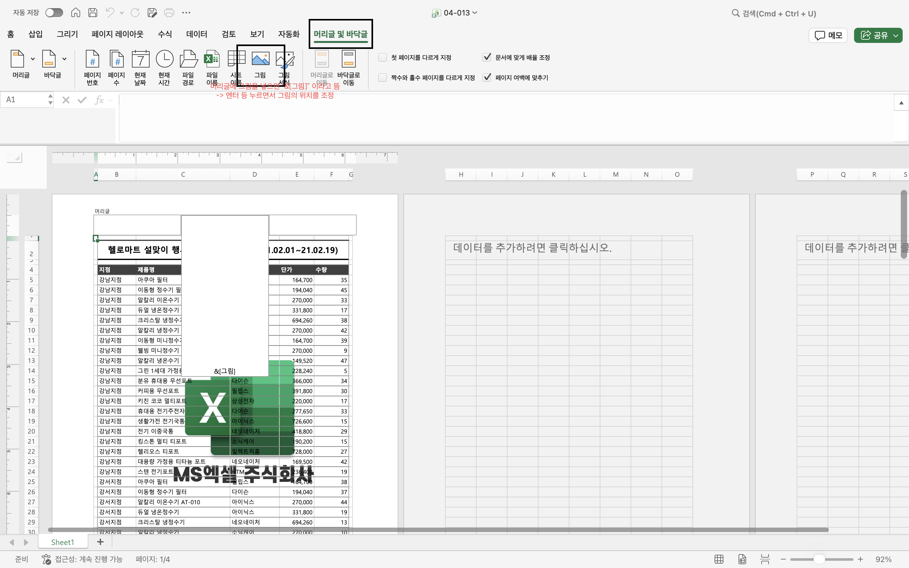
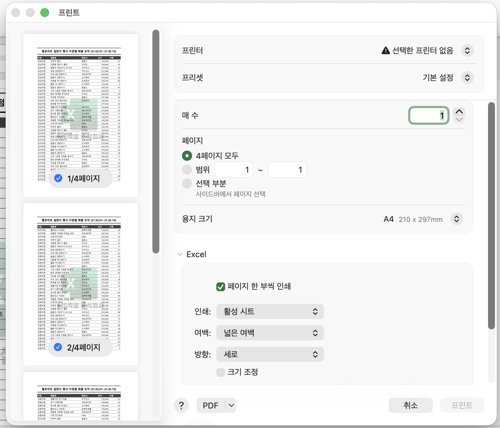
- 머리글/바닥글에 있는 그림 서식 - 밝기 80, 대비 12 조정 
---

### 🎉 수고하셨습니다.

