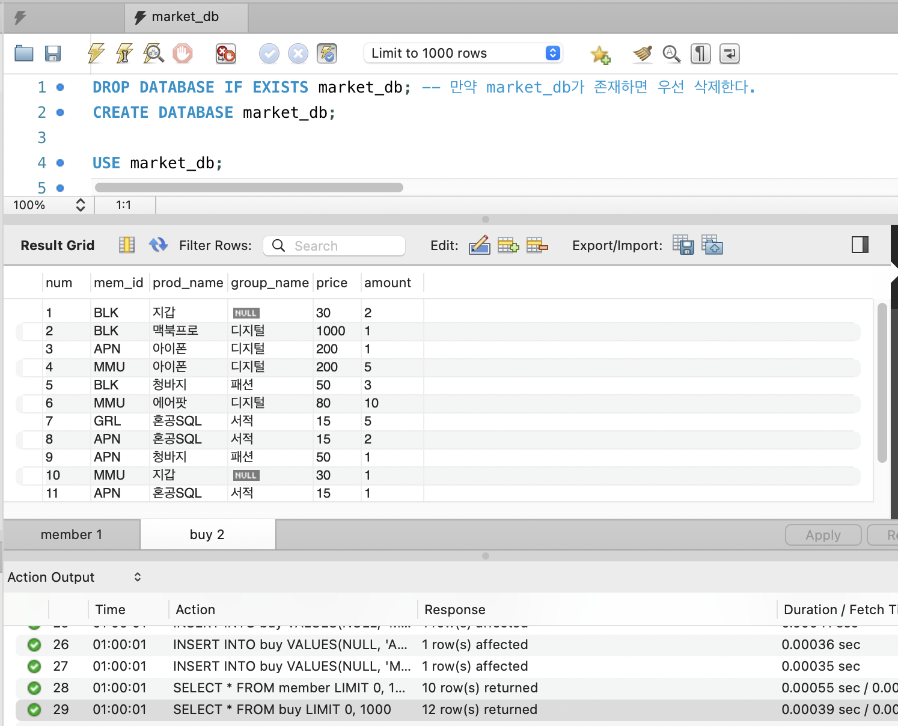
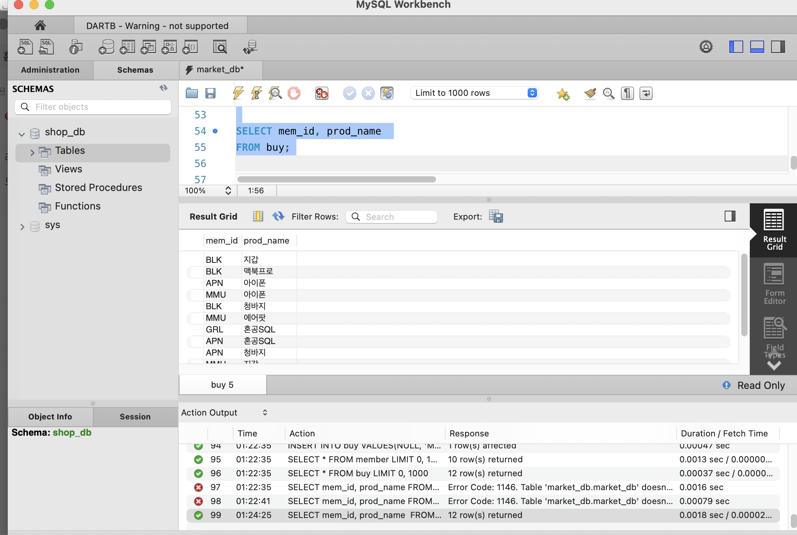
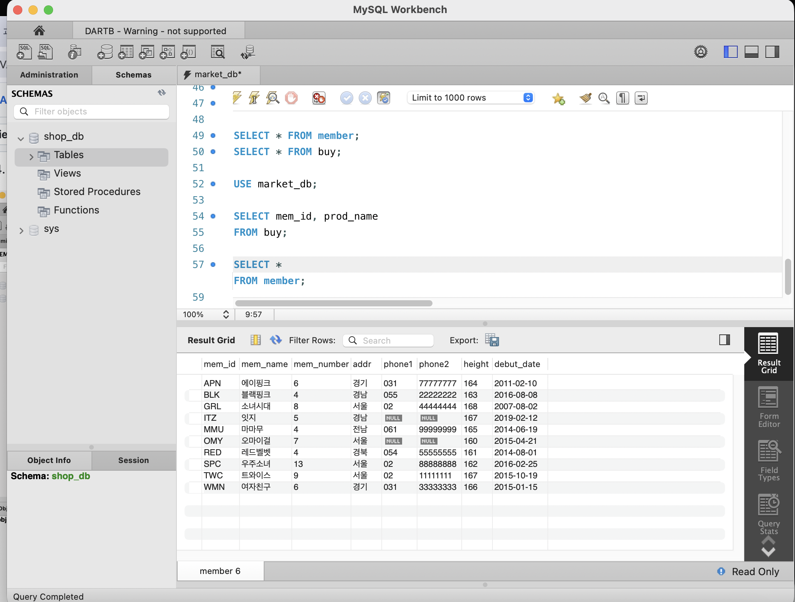
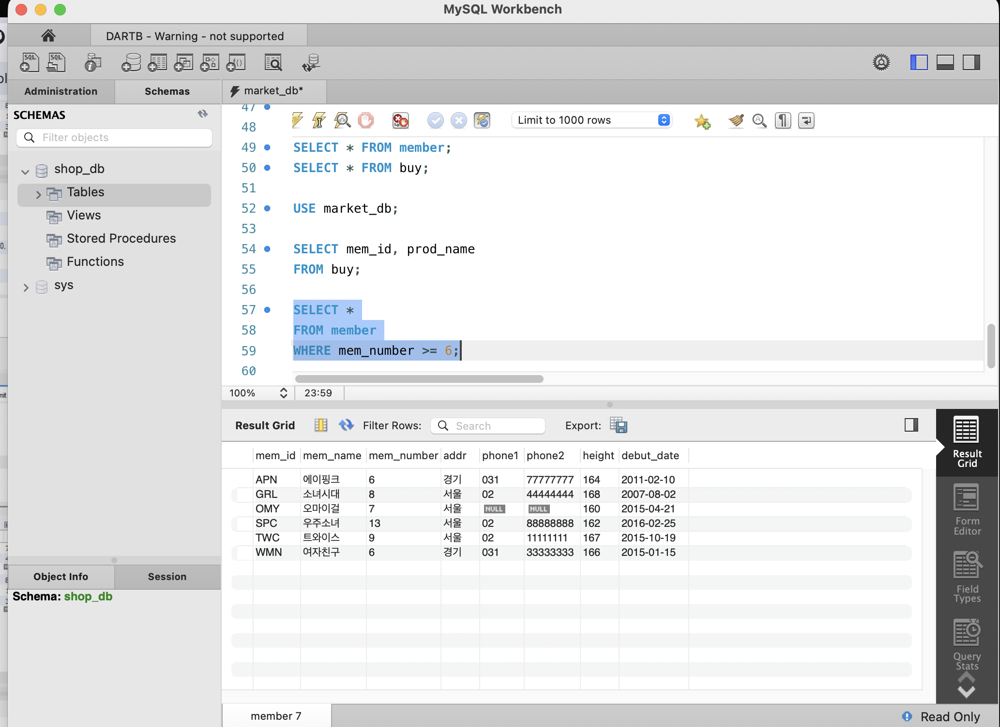
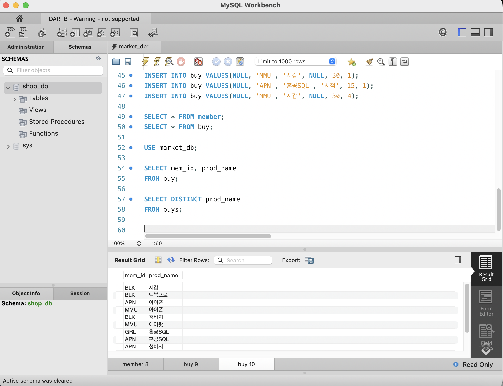
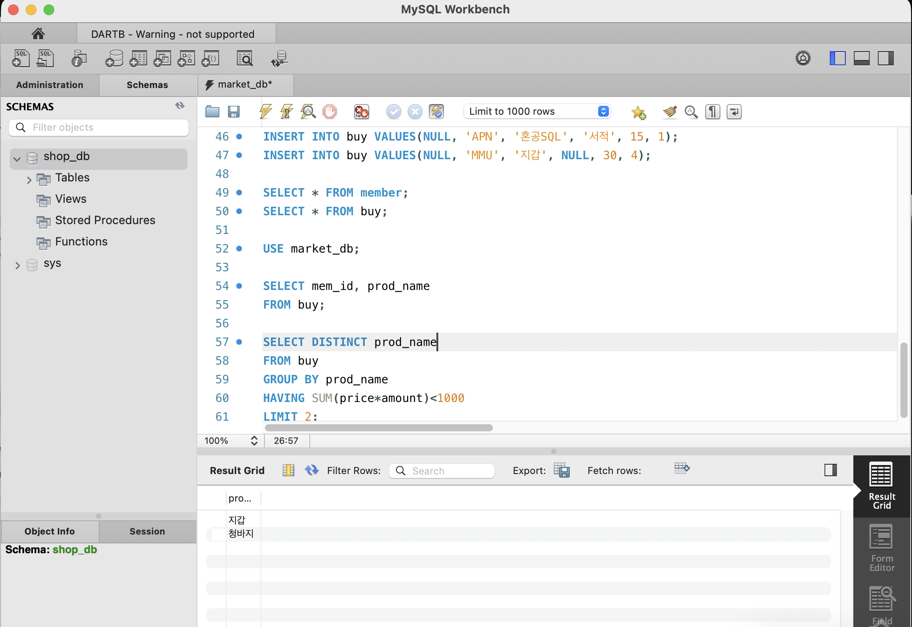

# SQL_ADVANCED 2주차 정규 과제 

📌SQL_ADVANCED 정규과제는 매주 정해진 분량의 『*혼자 공부하는 SQL*』 을 읽고 학습하는 것입니다. 이번주는 아래의 **SQL_ADVANCED_2nd_TIL**에 나열된 분량을 읽고 공부하시면 됩니다.

아래의 문제를 풀어보며 학습 내용을 점검하세요. 문제를 해결하는 과정에서 개념을 스스로 정리하고, 필요한 경우 제시된 강의를 참고하여 보완하는 것이 좋습니다.

<!-- 강의 링크는 아래와 같습니다.
https://www.youtube.com/watch?v=_JURyg_KzHE&list=PLVsNizTWUw7GCfy5RH27cQL5MeKYnl8Pm&index=7
https://www.youtube.com/watch?v=6qkPy7RfLqQ&list=PLVsNizTWUw7GCfy5RH27cQL5MeKYnl8Pm&index=8
https://www.youtube.com/watch?v=WWAFAm9op2U&list=PLVsNizTWUw7GCfy5RH27cQL5MeKYnl8Pm&index=9
-->

**교재 실습 예제 파일은 08_SQL_ADVANCED_Template 레포지토리의 src 폴더에 업로드되어 있습니다. market_db 파일도 해당 폴더에 함께 포함되어 있으니 참고하시기 바랍니다.**

**👀(수행 인증샷은 필수입니다.)** 

## SQL_ADVANCED_2nd_TIL

### 3장 SQL 기본 문법
#### 01. 기본 중에 기본 SELECT ~ FROM ~ WHERE
#### 02. 좀 더 깊게 알아보는 SELECT문
#### 03. 데이터 변경을 위한 SQL문


## Study Schedule

| 주차  | 공부 범위     | 완료 여부 |
| ----- | ------------- | --------- |
| 1주차 | p.24~99    | ✅         |
| 2주차 | p.102~155   | ✅         |
| 3주차 | p.158~213  | 🍽️         |
| 4주차 | p.216~271 | 🍽️         |
| 5주차 | p.274~327 | 🍽️         |
| 6주차 | p.330~369 | 🍽️         |
| 7주차 | p.372~407 | 🍽️         |


<br>

<!-- 여기까진 그대로 둬 주세요-->

---

# 1️⃣ 학습 내용 정리


## 1. `USE` 문: 사용할 데이터베이스 지정
- 특정 데이터베이스를 사용하겠다고 선언하는 명령어
- 이 명령어를 실행하지 않으면 쿼리가 어느 데이터베이스에서 실행되어야 할지 몰라 에러가 발생!

- **기본 문법**
  ```sql
  USE 데이터베이스_이름;

```

* **예시**
```sql
USE market_db;

```

* **핵심 포인트**
* "지금부터 이 DB를 사용하겠으니 모든 쿼리는 이 DB에서 실행하라"는 의미
* **한 번 지정해 두면, 다른 DB로 변경하기 전까지 모든 SQL 문은 해당 DB에서 수행됨**
* 💡 **주의사항**: MySQL 워크벤치를 재시작하거나 새 쿼리 창을 열었을 때는 `USE` 문을 **다시 실행**해야함


* **자주 발생하는 에러**
* 다른 DB(예: `sys`)가 선택된 상태에서 `market_db`에만 있는 테이블을 조회하려고 하면 `Table doesn't exist` (Error Code: 1146) 에러 발생


---

### `SELECT` 문의 전체 구조

* **실무에서 자주 쓰는 핵심 포맷**
```sql
SELECT 열_이름
FROM 테이블_이름
WHERE 조건식
GROUP BY 열_이름
HAVING 조건식
ORDER BY 열_이름
LIMIT 숫자

```


---

### `SELECT`와 `FROM`의 기본 사용법

DB 선택 -> 특정 테이블의 데이터를 모두 불러오는 가장 기초적 쿼리

* **실행 예시**
```sql
USE market_db;
SELECT * FROM member;

```


1. `USE market_db;` : 먼저 'market_db'를 사용하겠다고 지정
2. `SELECT * FROM member;` : 'member' 테이블에 있는 모든(`*`) 데이터 조회


```

```

<!-- 과제 페이지를 참조하여 인증 사진 2장을 아래의 부분을 지우고 제출해주세요. -->




> **확인문제: 주소의 지역이 서울, 경기인 회원을 추출하는 SQL 문입니다. 빈칸에 들어갈 수 있는 것을 모두 고르세요.**

```sql
SELECT *
FROM table
WHERE ________;
```

보기는 아래와 같습니다.
```
1. addr IN('서울', '경기')
2. addr BETWEEN '서울' AND '경기'
3. addr = '서울' OR addr = '경기'
4. addr = '서울' AND addr = '경기'
```

```
addr IN('서울', '경기'): `IN` 연산자를 사용하면 괄호 안에 나열된 값 중 하나라도 일치하는 데이터를 추출 ✅

addr = '서울' OR addr = '경기': `OR` 연산자를 통해 주소가 '서울'인 조건과 '경기'인 조건을 각각 연결 ✅ 

`BETWEEN`: 숫자, 날짜 등 연속적인 '범위(A부터 B까지)'를 검색할 때 사용하므로 개별 문자열 지정에는 적합 ❌
`AND`: 하나의 행에서 `addr` 값이 동시에 '서울'이면서 '경기'여야 한다는 의미가 되기에 적합 ❌ 
```


## 2. 좀 더 깊게 알아보는 SELECT문

<!-- ORDER BY절과 GROUP BY절 그리고 HAVING절에 관해 배우게 된 점을 적어주세요. -->

```

```sql
SELECT 열_이름
FROM 테이블_이름
WHERE 조건식
GROUP BY 열_이름
HAVING 조건식
ORDER BY 열_이름
LIMIT 숫자;
```

---

**ORDER BY 절: 데이터 정렬**
`WHERE` 절 다음에 위치

* **기본 정렬**: 오름차순 (`ASC`, 생략 가능)
* **내림차순 정렬**: 기준 열 이름 뒤에 `DESC` 추가

```sql
SELECT mem_id, mem_name, debut_date, height
FROM member
WHERE height >= 164
ORDER BY height DESC; -- 키가 큰 순서대로(내림차순) 정렬

```

**GROUP BY 절: 데이터 그룹화**
- 데이터를 특정 기준의 그룹으로 묶어줌
- `SUM()`, `AVG()`, `MIN()`, `MAX()`, `COUNT()` 집계 함수와 함께 사용되어 그룹별 통계를 나타냄 

```sql
-- 회원별로 구매한 개수(amount)의 합계를 구하는 쿼리
SELECT mem_id, SUM(amount) 
FROM buy 
GROUP BY mem_id;

```

**HAVING 절: 그룹 조건 지정**
- `GROUP BY`로 묶인 결과에 조건을 걸 때 사용
- `WHERE` 절에는 집계 함수에 대한 조건 사용 ❌

   ->  `GROUP BY` 절 다음에 `HAVING`

```sql
-- 총 구매 금액이 1000 이상인 회원만 내림차순으로 정렬하여 조회
SELECT mem_id "회원 아이디", SUM(price*amount) "총 구매 금액"
FROM buy
GROUP BY mem_id
HAVING SUM(price*amount) > 1000
ORDER BY SUM(price*amount) DESC;

```

---

**기타 핵심 문법**

* **LIMIT (출력 개수 제한)**: 결과물의 개수를 제한
    - `LIMIT 시작위치, 개수`: 중간부터 출력(시작 인덱스는 0부터 시작)
```sql
SELECT mem_name, height 
FROM member 
ORDER BY height DESC 
LIMIT 3, 2; -- 3번째 데이터부터 2건만 조회

```


* **DISTINCT (중복 제거)**: 조회할 열 이름 앞에 붙여 중복 데이터 제거
```sql
SELECT DISTINCT addr FROM member;

```
```

> **확인문제: 다음 표는 주요 집계함수를 정리한 것입니다. 각 설명에 해당하는 올바른 함수명을 기호에 맞게 작성하세요.**

| 함수명 | 설명 |
|--------|------|
| SUM() | 합계를 구합니다. |
| (ㄱ) | 평균을 구합니다. |
| (ㄴ) | 최소값을 구합니다. |
| MAX() | 최대값을 구합니다. |
| (ㄷ) | 행의 개수를 셉니다. |
| (ㄹ) | 행의 개수를 셉니다 (중복은 1개만 인정). |
```

```
여기에 답을 적어주세요!
(ㄱ) AVG()
(ㄴ) MIN()
(ㄷ) COUNT()
(ㄹ) COUNT(DISTINCT)
```

## 3. 데이터 변경을 위한 SQL문

<!-- INSERT문, UPDATE문, DELETE문에 관해 배우게 된 점을 적어주세요. -->

```
## INSERT 문: 데이터 입력
테이블에 새로운 행(데이터)을 삽입할 때 사용

* **기본 사용**
    - 생략된 열 없이 입력할 때는 `VALUES` 뒤에 테이블 열 순서와 개수에 맞춰 값 지정 
    - 특정 열만 지정할 경우 나머지 열에는 `NULL` 값이 들어감
* **자동 증가(AUTO_INCREMENT)**
    - 열이 1부터 자동으로 증가하도록 설정된 경우, 데이터 입력 시 `NULL`로 지정하면 자동으로 채워짐
    - (해당 열은 반드시 `PRIMARY KEY`여야 함)
* **대량 데이터 복사**: `INSERT INTO ~ SELECT` 구문을 사용하면 다른 테이블의 데이터를 한 번에 가져와서 입력할 수 있음

```sql
-- 여러 줄의 데이터를 한 번에 입력하는 예시
INSERT INTO hongong1 VALUES (1, '우디', 25), (2, '버즈', 20);

```

## UPDATE 문: 데이터 수정
기존에 입력되어 있는 행 데이터의 값을 수정할 때 사용

* **다중 열 수정**
    - `SET` 구문 뒤에 콤마(`,`)로 구분하여 여러 개의 열 값을 동시에 변경
* 🚨 **주의사항**: `WHERE` 조건절은 생략이 가능하지만, 생략할 경우 **테이블의 모든 행 데이터가 변경됨**

```sql
-- city_name이 'New York'인 데이터의 이름과 인구를 동시에 수정
UPDATE city_popul
SET city_name = '뉴욕', population = 0
WHERE city_name = 'New York';

```

**DELETE 문: 데이터 삭제**
테이블의 데이터를 행 단위로 삭제할 때 사용

* **개수 제한 삭제**
    - `LIMIT` 사용하여 조건에 맞는 데이터 중 상위 몇 건만 제한적으로 삭제!
* 🚨 **주의사항**: `UPDATE`와 마찬가지로 `WHERE` 조건절 없이 실행하면 테이블의 **모든 행 데이터가 삭제됨**

```sql
-- 'New'로 시작하는 도시 중 상위 5건만 삭제
DELETE FROM city_popul
WHERE city_name LIKE 'New%'
LIMIT 5;

```


# 2️⃣ 실습과제

다음 SQL 문을 작성하고 실행 결과를 확인 후 인증 사진을 아래에 업로드하세요.(market_db를 그대로 사용합니다.)

1. 모든 그룹 멤버의 정보를 조회하시오.
2. 멤버의 수가 6명 이상인 그룹 정보를 조회하시오.
3. 현재 구매 테이블에 존재하는 서로 다른 상품(prod_name)이 어떤 것이 있는지 조회하시오.
4. 총 구매 금액이 1000미만인 prod_name 중 상위 2개만 조회하시오.

1. 모든 그룹 멤버의 정보를 조회하시오.

2. 멤버의 수가 6명 이상인 그룹 정보를 조회하시오.

3. 현재 구매 테이블에 존재하는 서로 다른 상품(prod_name)이 어떤 것이 있는지 조회하시오.

4. 총 구매 금액이 1000미만인 prod_name 중 상위 2개만 조회하시오.



### 🎉 수고하셨습니다.


