# SQL_ADVANCED 3주차 정규 과제 

📌SQL_ADVANCED 정규과제는 매주 정해진 분량의 『*혼자 공부하는 SQL*』 을 읽고 학습하는 것입니다. 이번주는 아래의 **SQL_ADVANCED_3rd_TIL**에 나열된 분량을 읽고 공부하시면 됩니다.

아래의 문제를 풀어보며 학습 내용을 점검하세요. 문제를 해결하는 과정에서 개념을 스스로 정리하고, 필요한 경우 제시된 강의를 참고하여 보완하는 것이 좋습니다.

<!-- 강의 링크는 아래와 같습니다.
https://www.youtube.com/watch?v=1YmWy-7-OhQ&list=PLVsNizTWUw7GCfy5RH27cQL5MeKYnl8Pm&index=10
https://www.youtube.com/watch?v=tuQFkzjqEGw&list=PLVsNizTWUw7GCfy5RH27cQL5MeKYnl8Pm&index=11
https://www.youtube.com/watch?v=IOCsreDYqFE&list=PLVsNizTWUw7GCfy5RH27cQL5MeKYnl8Pm&index=12
-->

**교재 실습 예제 파일은 08_SQL_ADVANCED_Template 레포지토리의 src 폴더에 업로드되어 있습니다. market_db 파일도 해당 폴더에 함께 포함되어 있으니 참고하시기 바랍니다.**

**👀(수행 인증샷은 필수입니다.)** 

## SQL_ADVANCED_3rd_TIL

### 4장 SQL 고급 문법
#### 01. MySQL의 데이터 형식
#### 02. 두 테이블을 묶는 조인
#### 03. SQL 프로그래밍 


## Study Schedule

| 주차  | 공부 범위     | 완료 여부 |
| ----- | ------------- | --------- |
| 1주차 | p.24~99    | ✅         |
| 2주차 | p.102~155   | ✅         |
| 3주차 | p.158~213  | ✅         |
| 4주차 | p.216~271 | 🍽️         |
| 5주차 | p.274~327 | 🍽️         |
| 6주차 | p.330~369 | 🍽️         |
| 7주차 | p.372~407 | 🍽️         |


<br>

<!-- 여기까진 그대로 둬 주세요-->

---

# 1️⃣ 학습 내용 정리

## 1. MySQL의 데이터 형식


### 데이터 형식 (Data Types)

#### 1. 숫자형
*   **정수형 (`INT`, `SMALLINT` 등)**: 소수점이 없는 숫자 (인원 수, 가격, 수량 등에 사용)
*   **실수형 (`FLOAT` 등)**: 소수점이 있는 숫자 저장 (일반적으로 `FLOAT`으로 충분)

#### 2. 문자형
*   글자를 저장하기 위해 사용
*   **`CHAR`**: 고정길이 문자형 (공간은 차지하지만 검색 속도 등 성능 우수)
    *   *참고*: 회원 ID(BLK, APK 등)가 3글자여도 향후 긴 ID를 고려해 `CHAR(8)`로 설정 가능
    *   *참고*: 전화번호는 더하기/빼기 등 숫자로서의 연산 의미가 없으므로 `CHAR` 지정
*   **`VARCHAR`**: 가변길이 문자형 (입력된 만큼만 차지하여 공간 효율적)

#### 3. 대용량 데이터 (`TEXT`, `BLOB`)
*   기존 형식(`CHAR`, `VARCHAR`)을 넘어 더 큰 데이터를 저장할 때 사용
*   **`LONGTEXT`**: 자막, 대본 등 매우 긴 글자 데이터
*   **`LONGBLOB`**: 이미지, 동영상 등 이진 데이터 (글자 X)

```sql
CREATE DATABASE netflix_db;
USE netflix_db;

CREATE TABLE movie (
    movie_id INT,
    movie_title VARCHAR(30),
    movie_director VARCHAR(20),
    movie_star VARCHAR(20),
    movie_script LONGTEXT, -- 영화 자막/대본
    movie_film LONGBLOB    -- 영화 동영상
);

```

#### 4. 날짜형

* **`DATE` / `DATETIME**`: 날짜, 시간 저장

---

### 변수의 사용

* **`SET @변수이름 = 변수의 값;`** : 변수 선언 및 값 대입
* **`SELECT @변수이름;`** : 변수 값 출력

#### LIMIT절 변수 사용 방법 (`PREPARE`, `EXECUTE`)

* `LIMIT`에는 변수를 직접 사용할 수 없어 `PREPARE`와 `EXECUTE`로 해결
* **`PREPARE`**: 실행하지 않고 SQL문만 먼저 준비 (나중에 채울 빈칸은 `?` 처리)
* **`EXECUTE`**: `USING`을 통해 준비된 `?` 자리에 변수 값을 대입하여 쿼리 실행

```sql
SET @count = 3; -- @count 변수에 3 대입

-- mySQL이라는 이름으로 쿼리 준비 (?는 향후 채워질 자리)
PREPARE mySQL FROM 'SELECT mem_name, height FROM member ORDER BY height LIMIT ?'; 

-- 저장된 쿼리를 실행하며 ?에 @count(3) 대입 
EXECUTE mySQL USING @count; 
-- 최종 실행 결과: LIMIT 3과 동일

```

---

### 데이터형 변환

#### 1. 명시적 변환

* 함수(`CAST()`, `CONVERT()`)를 사용하여 직접 형 변환
* 기본 형태: `CAST(값 AS 데이터_형식)`, `CONVERT(값, 데이터_형식)`

```sql
-- 실수형 평균 결과를 정수형(SIGNED)으로 변환
SELECT CAST(AVG(price) AS SIGNED) AS '평균가격' FROM buy; 
SELECT CONVERT(AVG(price), SIGNED) AS '평균가격' FROM buy; 
-- 결과: 143 

-- 다양한 구분자의 문자열을 날짜형(DATE)으로 변환
SELECT CAST('2022$12$12' AS DATE);
SELECT CAST('2022/12/12' AS DATE);
SELECT CAST('2022%12%12' AS DATE);
-- 결과: 모두 동일하게 2022-12-12

```

#### 2. 암시적 변환

* 함수 사용 없이 문맥에 따라 자동으로 형이 변환됨

```sql
-- 더하기(+) 연산: 문자열을 알아서 숫자로 변환 후 연산
SELECT '100' + '200'; -- 결과: 300
SELECT 100 + '200';   -- 결과: 300

-- CONCAT 함수: 문자를 이어 붙이는 기능이므로 숫자를 알아서 문자열로 변환
SELECT CONCAT('100', '200'); -- 결과: 100200
SELECT CONCAT(100, '200');   -- 결과: 100200

```
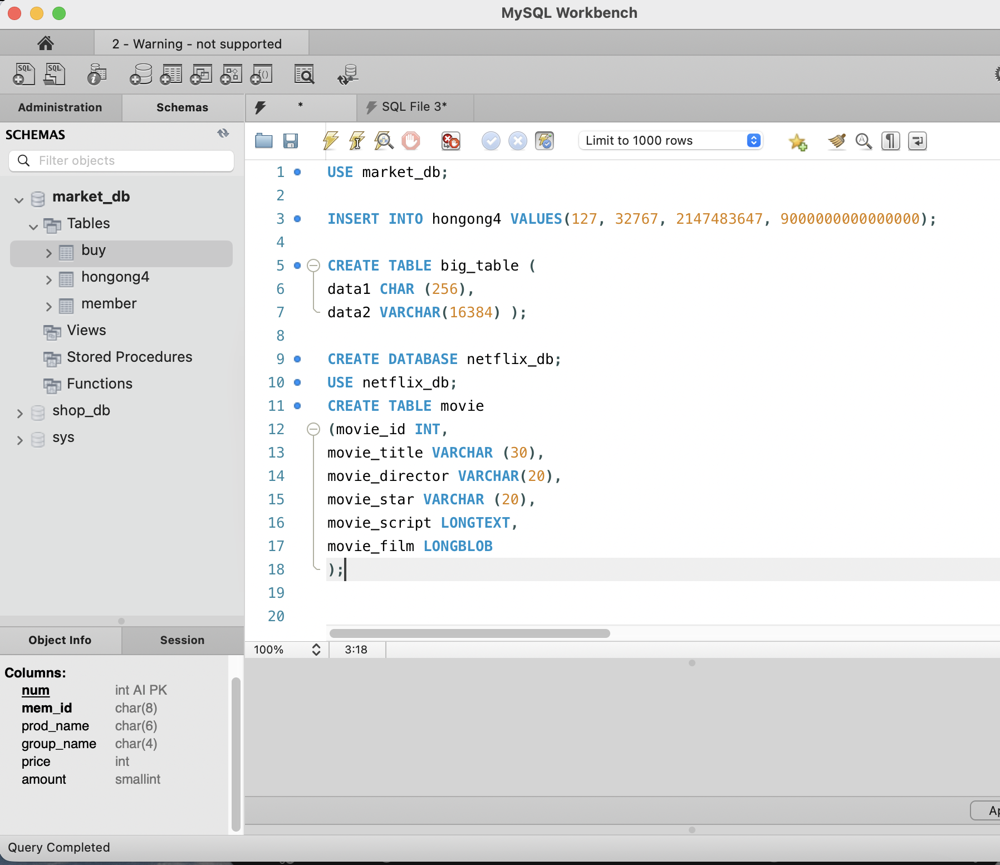
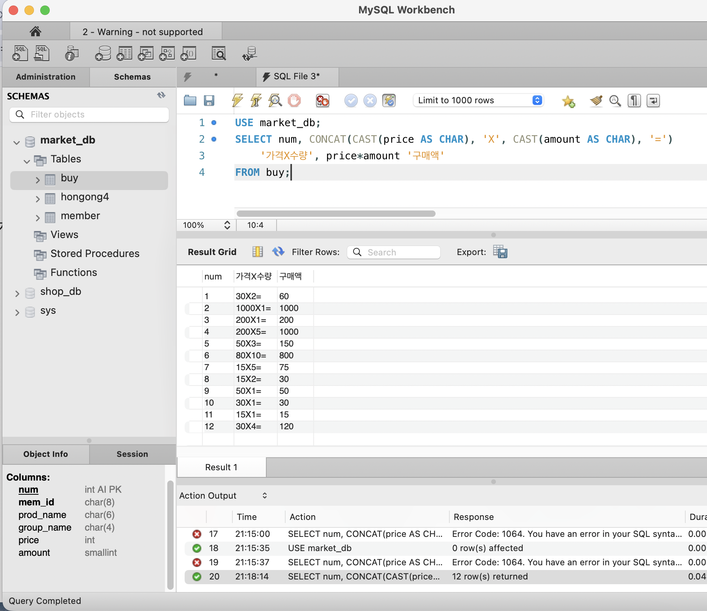

```

```

> **확인문제: 다음 보기에서 데이터 형식의 변환에 사용되는 함수를 2개 고르세요.**

보기는 아래와 같습니다.
```
CONVERT() / DATA() / CAST() / MOVE() / TYPE() / SUM() / AVG() / CURRENT_DATE()
```

```
CONVERT(), CAST()
CAST(): 데이터의 형식을 명시적으로 변환
CONVERT(): CAST()와 기능적으로 동일, 데이터 형식을 변환 (작성 방식만 다름)
```


## 2. 두 테이블을 묶는 조인

<!-- 두 테이블을 묶는 조인에 관해 배우게 된 점을 적어주세요. -->

### 내부 조인 (INNER JOIN)

*   두 테이블 모두 데이터가 있는 경우만 결과 출력
*   테이블 간 일대다(1:N) 관계로 연결 필요
    *   회원 테이블(기본키, PK) ↔ 구매 테이블(외래키, FK)

#### 1. 기본 문법
```sql
SELECT <열 목록>
FROM <첫 번째 테이블>
INNER JOIN <두 번째 테이블>
ON <조인될 조건>
[WHERE 검색 조건]

```

#### 2. 활용 예시

* **특정 회원('GRL') 구매 내역 조회**
```sql
USE market_db;
SELECT *
FROM buy
INNER JOIN member
ON buy.mem_id = member.mem_id
WHERE buy.mem_id = 'GRL';

```
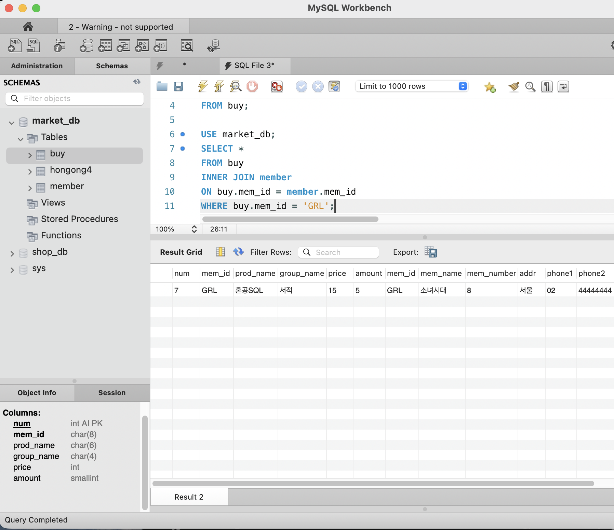


* **`WHERE` 조건 생략 시**: 구매 테이블의 모든 행이 회원 테이블과 전부 결합
```sql
USE market_db;
SELECT *
FROM buy
INNER JOIN member
ON buy.mem_id = member.mem_id;

```
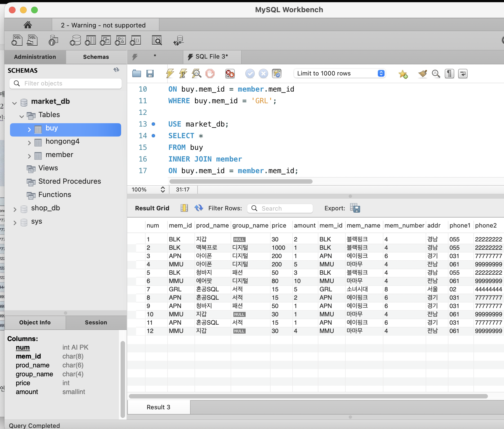


#### 3. 테이블 별칭(Alias)과 DISTINCT

* 동일 열 이름(`mem_id`) 존재 시 소속 테이블 미명시 오류 발생
* 테이블명 뒤 별칭 부여로 코드 간소화
```sql
SELECT B.mem_id, M.mem_name, B.prod_name, M.addr,
       CONCAT(M.phone1, M.phone2) AS '연락처'
FROM buy B      -- 테이블 별칭 B
INNER JOIN member M  -- 테이블 별칭 M
ON B.mem_id = M.mem_id;

```
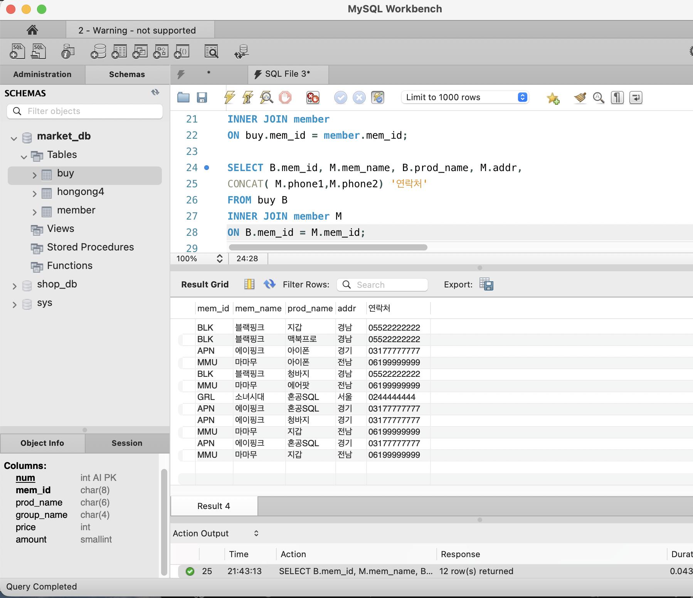


* **중복 제거 (`DISTINCT`)**: 중복 데이터 제거 후 1회만 깔끔하게 출력
```sql
SELECT DISTINCT M.mem_id, M.mem_name, M.addr
FROM buy B
INNER JOIN member M
ON B.mem_id = M.mem_id
ORDER BY M.mem_id;

```


---

### 외부 조인 (OUTER JOIN)

* 한쪽 테이블에만 데이터가 있어도 결과 출력 가능

#### 1. 기본 문법

```sql
SELECT <열 목록>
FROM <첫 번째 테이블 (LEFT 테이블)>
<LEFT FULL RIGHT |> OUTER JOIN <두 번째 테이블 (RIGHT 테이블)>
ON <조인될 조건>
[WHERE 검색 조건];

```

#### 2. LEFT / RIGHT 조인 비교

* **`LEFT OUTER JOIN`**: 왼쪽 테이블 기준 (왼쪽 테이블 전부 + 오른쪽 테이블 조인 값)
* **`RIGHT OUTER JOIN`**: 오른쪽 테이블 기준 (오른쪽 테이블 전부 + 왼쪽 테이블 조인 값)

#### 3. 활용 예시

* **전체 회원 목록과 구매 내역 (구매 이력 없는 회원 포함)**
```sql
SELECT M.mem_id, M.mem_name, B.prod_name, M.addr
FROM member M 
LEFT OUTER JOIN buy B
ON M.mem_id = B.mem_id
ORDER BY M.mem_id;

```


* **응용**: 가입 후 구매 이력 없는 회원(유령 회원) 추출
* 위 쿼리 마지막에 `WHERE B.prod_name IS NULL` 조건 추가
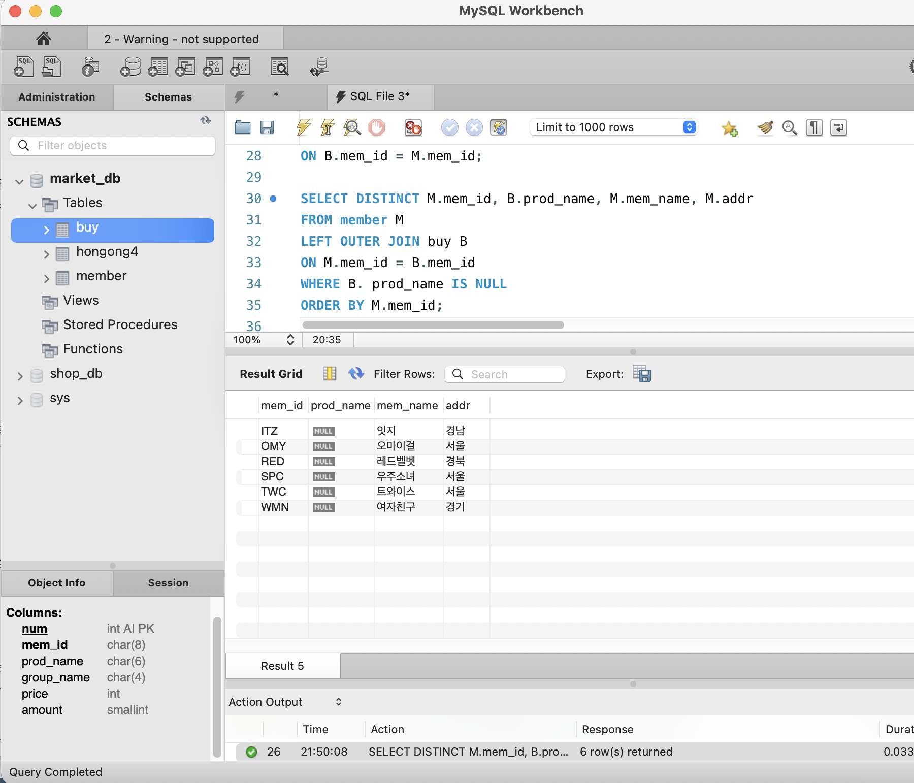


---

### 상호 조인 (CROSS JOIN)

* 양쪽 테이블의 모든 행을 각각 결합
* 결과 행 개수 = (테이블 A 행 개수) × (테이블 B 행 개수)
* `ON` 구문 사용 불가
* 결과 내용은 의미 없는 랜덤 조인
* 주로 대용량 테스트(더미) 데이터 생성 시 사용

#### 1. 활용 예시

* **기본 상호 조인**
```sql
SELECT *
FROM buy
CROSS JOIN member;

```


* **대용량 테스트 테이블 생성**
```sql
CREATE TABLE cross_table
SELECT *
FROM sakila.actor 
CROSS JOIN world.country; 

SELECT * FROM cross_table LIMIT 5; -- 5개만 출력 확인

```


```

```

> **확인문제: 다음 SQL은 회원으로 가입만 하고, 한 번도 구매한 적이 없는 회원의 목록을 조회하는 쿼리입니다. 빈칸에 들어갈 가장 적절한 구문을 고르세요..**

```sql
SELECT DISTINCT M.mem_id, B.prod_name, M.mem_name, M.addr
  FROM member M
    LEFT OUTER JOIN buy B
    ON M.mem_id = B.mem_id
  __________
  ORDER BY M.mem_id;
```
보기는 아래와 같습니다.
```
1. JOIN B.prod_name IS NULL
2. LIMIT B.prod_name IS NULL
3. HAVING B.prod_name IS NULL
4. WHERE B.prod_name IS NULL
```
```
4. WHERE B.prod_name IS NULL
```

## 3. SQL 프로그래밍 

<!-- IF문, CASE문, WHILE문에 관해 배우게 된 점을 적어주세요. -->

### 1. IF 문 (단일/이중 분기)

* 조건식이 참(True)이라면 지정된 SQL 문장들을 실행하고, 거짓이면 넘어가는 가장 기본적인 제어문.


* 참일 때와 거짓일 때를 나누어 처리하려면 `IF ~ ELSE` 형식을 사용.


* 실행할 SQL 문장이 두 줄 이상일 경우 반드시 `BEGIN ~ END`로 묶어야 하며, 한 줄이더라도 습관적으로 묶어주는 것을 권장.


* **스토어드 프로시저**: SQL 프로그래밍(IF, CASE, WHILE 등)은 단독으로 실행할 수 없고, 반드시 `CREATE PROCEDURE`로 스토어드 프로시저를 만든 후 `CALL`로 호출해서 사용해야 함.


```sql
-- IF ~ ELSE 문 기본 활용 형태[cite: 30, 31]
DROP PROCEDURE IF EXISTS ifProc; -- 기존에 있으면 삭제[cite: 29]
DELIMITER $$ -- 종료 문자를 $$로 임시 변경[cite: 27]
CREATE PROCEDURE ifProc()
BEGIN
    DECLARE days INT; -- 변수 선언[cite: 30]
    -- 날짜 차이(DATEDIFF)를 계산하여 변수에 대입 (CURRENT_DATE는 오늘 날짜)[cite: 31, 32]
    SET days = DATEDIFF(CURRENT_DATE(), '2015-01-01'); 
    
    IF (days/365) >= 5 THEN -- 조건식: 5년이 넘었는지 확인[cite: 31]
        SELECT '5년이 지났습니다.'; -- 참일 때 실행[cite: 31]
    ELSE
        SELECT '5년이 안 되었습니다.'; -- 거짓일 때 실행[cite: 31]
    END IF; -- IF문 종료[cite: 28]
END $$
DELIMITER ; -- 종료 문자를 다시 세미콜론(;)으로 복구[cite: 27]

CALL ifProc(); -- 스토어드 프로시저 실행[cite: 27, 29]

```

### 2. CASE 문 (다중 분기)

* 조건이 여러 가지(2가지 이상)일 때 사용하는 다중 분기문.


* 다른 프로그래밍 언어의 `SWITCH ~ CASE` 문과 비슷한 역할 수행.


* 모든 `WHEN` 조건에 해당하지 않으면 `ELSE` 부분을 수행하며, 마지막엔 `END CASE`로 닫음.


* **실무 활용**: 스토어드 프로시저 내부뿐만 아니라, 일반 `SELECT` 문 안에서 열 데이터를 조건에 따라 변환(예: 구매액에 따른 회원 등급 부여)할 때 매우 자주 사용.


```sql
-- 실무형 CASE 문 활용 예시 (총 구매액 기준 회원 등급 분류)[cite: 35, 36]
SELECT M.mem_id, M.mem_name, 
       SUM(price * amount) AS "총구매액", -- 구매액 합계 계산[cite: 35]
       CASE 
           WHEN (SUM(price * amount) >= 1500) THEN '최우수고객' -- 1500 이상[cite: 36]
           WHEN (SUM(price * amount) >= 1000) THEN '우수고객'   -- 1000 이상 1500 미만[cite: 36]
           WHEN (SUM(price * amount) >= 1) THEN '일반고객'      -- 1 이상 1000 미만[cite: 36]
           ELSE '유령고객'                                      -- 0 이하 (구매 이력 없음)[cite: 36]
       END AS "회원등급" -- CASE문 결과를 담을 새로운 열 이름 지정[cite: 36]
FROM buy B
    -- 구매한 적 없는(총구매액이 없는) 회원도 등급(유령고객)을 매기기 위해 RIGHT OUTER JOIN 사용[cite: 35]
    RIGHT OUTER JOIN member M 
    ON B.mem_id = M.mem_id[cite: 35]
GROUP BY M.mem_id -- 회원 아이디별로 그룹화[cite: 36]
ORDER BY SUM(price * amount) DESC; -- 총 구매액 기준 내림차순 정렬[cite: 36]

```

### 3. WHILE 문 (반복문)

* 조건식이 참인 동안 SQL 문장들을 계속 반복 수행.


* **기본 문법**: `WHILE <조건식> DO ... END WHILE;`.


* **반복문 제어 키워드**

* **`ITERATE [라벨]`**: 지정한 라벨로 이동하여 계속 진행 (타 언어의 `CONTINUE` 역할).
* **`LEAVE [라벨]`**: 지정한 라벨의 반복문을 즉시 종료하고 빠져나감 (타 언어의 `BREAK` 역할).


* **라벨(Label)**: `라벨명:` 형태로 반복문에 이름을 붙여 `ITERATE` 및 `LEAVE`와 짝지어 사용.


```sql
-- 1~100 합계 구하기 (단, 4의 배수는 제외하고 합이 1000이 넘으면 즉시 종료)[cite: 39]
myWhile: -- 반복문 라벨 지정[cite: 39]
WHILE (i <= 100) DO
    IF (i % 4 = 0) THEN
        SET i = i + 1;
        ITERATE myWhile; -- 4의 배수면 아래 코드를 건너뛰고 다시 반복 시작[cite: 39]
    END IF;
    
    SET hap = hap + i; -- 합계 누적[cite: 39]
    
    IF (hap > 1000) THEN
        LEAVE myWhile; -- 합계가 1000 초과 시 즉시 반복문 탈출[cite: 39]
    END IF;
    
    SET i = i + 1;
END WHILE;[cite: 39]

```

---

### 4. 동적 SQL (Dynamic SQL)

* SQL 문을 미리 고정하지 않고, 실행 시점의 상황에 따라 실시간으로 내용을 변경하여 실행할 때 사용.


* **3단계 핵심 키워드**

* **`PREPARE`**: SQL 문장을 즉시 실행하지 않고 준비만 해둠.
* **`EXECUTE`**: 준비된 SQL 문장을 실행.
* **`DEALLOCATE PREPARE`**: 실행 완료 후 메모리에서 문장을 해제.


* **`?` 기호와 `USING**`: 쿼리문에 `?`로 빈칸을 만들어 두고, `EXECUTE` 시점에 `USING`으로 변수 값을 전달하여 쿼리를 완성.


```sql
-- 출입문 데이터 기록 등 실시간 데이터 삽입에 활용하는 예시[cite: 41]
SET @curDate = CURRENT_TIMESTAMP(); -- 현재 날짜/시간을 변수에 저장[cite: 41]

-- INSERT 쿼리를 준비하며, 들어갈 값을 '?'로 처리하여 비워둠[cite: 41]
PREPARE myQuery FROM 'INSERT INTO gate_table VALUES(NULL, ?)';[cite: 41]

-- 준비된 myQuery를 실행하되, '?' 자리에 @curDate 변수 값을 대입[cite: 41]
EXECUTE myQuery USING @curDate;[cite: 41]

-- 사용이 끝난 준비된 문장 메모리 해제[cite: 41]
DEALLOCATE PREPARE myQuery;[cite: 41]

```

> **확인문제: 다음은 CASE 문의 형식입니다. 빈칸에 들어갈 가장 적절한 명령어를 보기에서 고르세요..**

```sql
CASE
    (1) 조건 THEN
        SQL문장들1
    ELSE
        SQL문장들4
END (2);
```

보기는 아래와 같습니다.
```
WHEN / THEN / CURRENT / DATE / TIME / IF / END IF / CASE
```

```
여기에 답을 적어주세요!
(1) WHEN
(2) CASE
```


---

# 2️⃣ 실습과제

## 1. 데이터베이스 구축

아래 코드를 MySQL Workbench에 붙여넣은 후,  
**전체 드래그 → 실행 (Ctrl + shift + Enter)** 하여 데이터베이스를 구축하세요.

```sql
-- 1. 데이터베이스 생성
CREATE DATABASE IF NOT EXISTS week3_db;

-- 2. 사용할 데이터베이스 선택
USE week3_db;

-- 3. 기존 테이블 삭제 (초기화용)
DROP TABLE IF EXISTS orders;
DROP TABLE IF EXISTS customers;

-- 4. 테이블 생성 (조인 실습용)
CREATE TABLE customers (
    customer_id INT PRIMARY KEY,
    name VARCHAR(20),
    signup_date_str VARCHAR(8) 
);

CREATE TABLE orders (
    order_id INT PRIMARY KEY,
    customer_id INT,           
    order_date_str VARCHAR(8), 
    amount_str VARCHAR(10)     
);

-- 5. 데이터 삽입
INSERT INTO customers VALUES
(1, '신영', '20241528'),
(2, '경모', '20220261'),
(3, '세원', '20203401'),
(4, '진우', '20221024'),
(5, '성환', '20225100'),
(6, '혜준', '20244946'),
(7, '채은', '20250412'),
(8, '다나', '20212774'); -- 주문 없는 고객(외부 조인용)

INSERT INTO orders VALUES
(101, 1, '20240220', '12000'),
(102, 1, '20240303', '30000'),
(103, 2, '20240111', '15000'),
(104, 3, '20221201', '9000'),
(105, 5, '20231111', '20000'),
(106, 7, '20220707', '5000'),
(107, 99, '20240210', '7000'); -- 고객 테이블에 없는 customer_id (외부 조인용)
```

## 2. 실습 문제

다음 SQL 문을 작성하고 실행 결과를 확인 후 인증 사진을 아래에 업로드하세요.

1. **데이터 형식 변환**
   - orders 테이블의 `order_date_str`을 DATE 형식으로 변환하여 조회하시오.
   (힌트: STR_TO_DATE 사용)

2. **데이터 형식 변환**
   - orders 테이블의 `amount_str`을 숫자형으로 변환하여 조회하시오.

3. **내부 조인 (INNER JOIN)**
   - customers와 orders를 customer_id 기준으로 내부 조인하여
     고객 이름(name)과 주문 번호(order_id)를 함께 조회하시오.

4. **외부 조인 (LEFT JOIN)**
   - customers를 기준으로 LEFT JOIN을 수행하여,
     주문이 없는 고객도 함께 조회하시오.

5. **스토어드 프로시저 (IF문 사용)**
   - 입력받은 금액이 10000 이상이면 '고액 주문',
     그렇지 않으면 '일반 주문'을 출력하는
     프로시저를 생성하시오.
   - 생성 후 CALL로 실행 결과를 확인하시오.

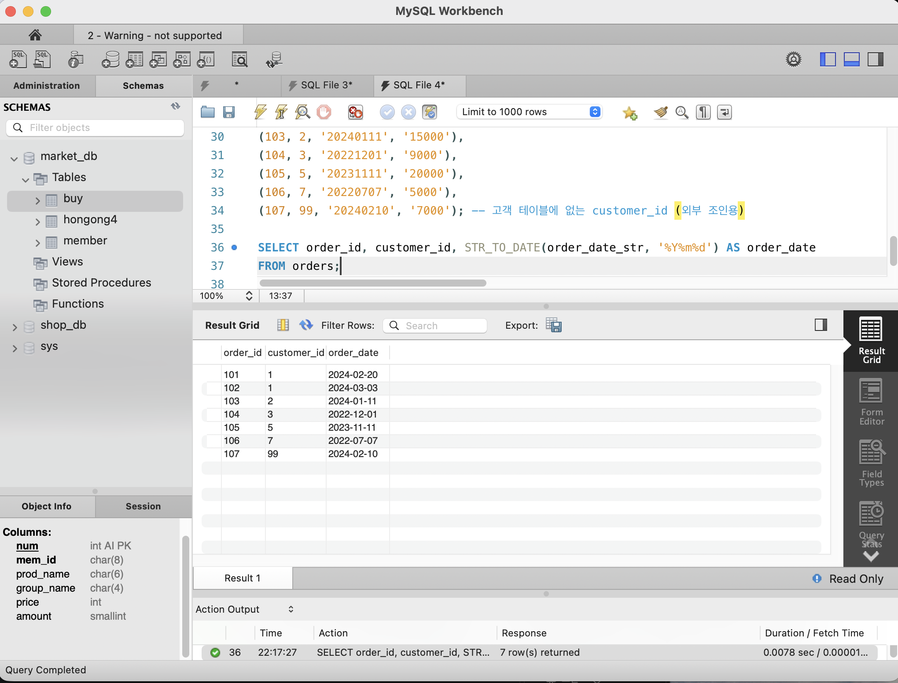
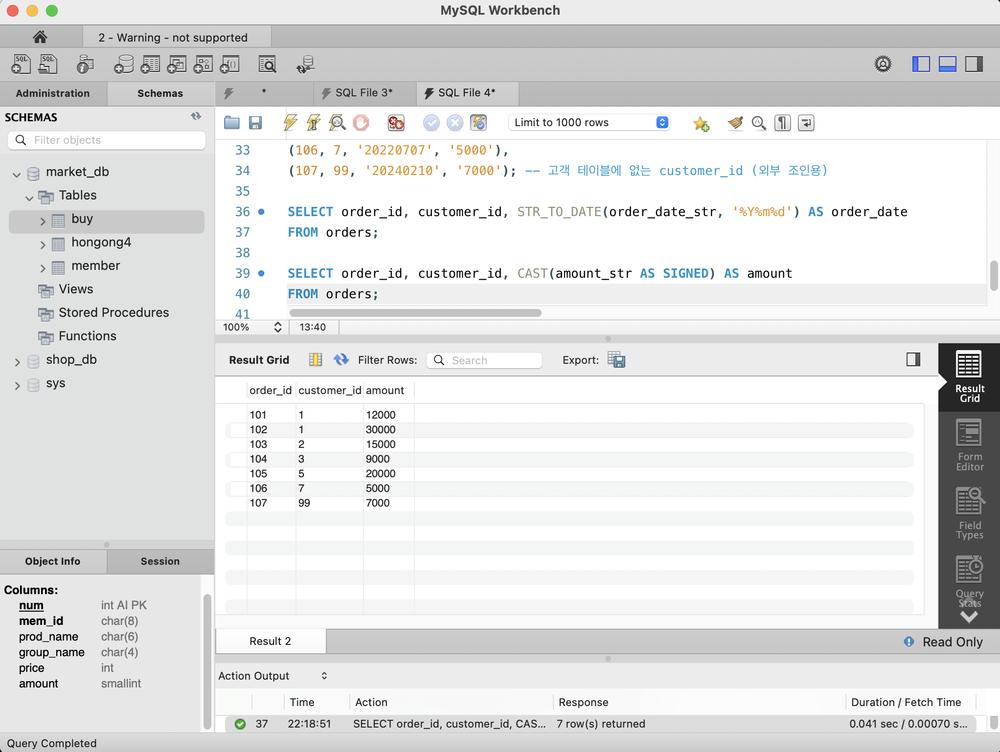
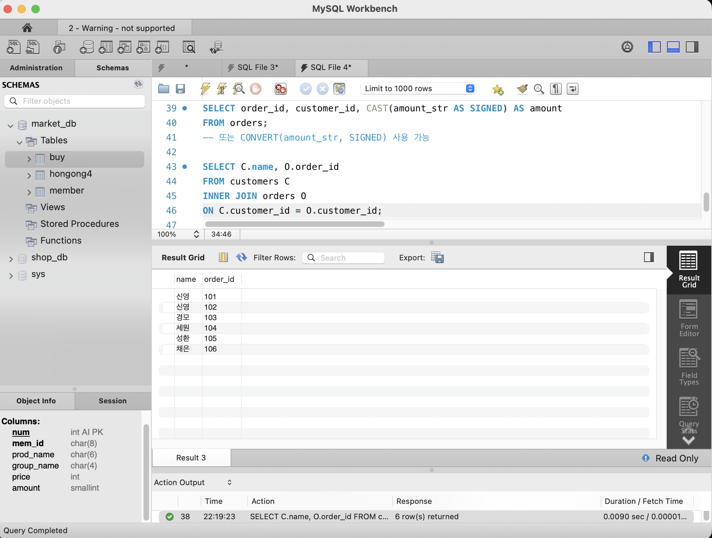
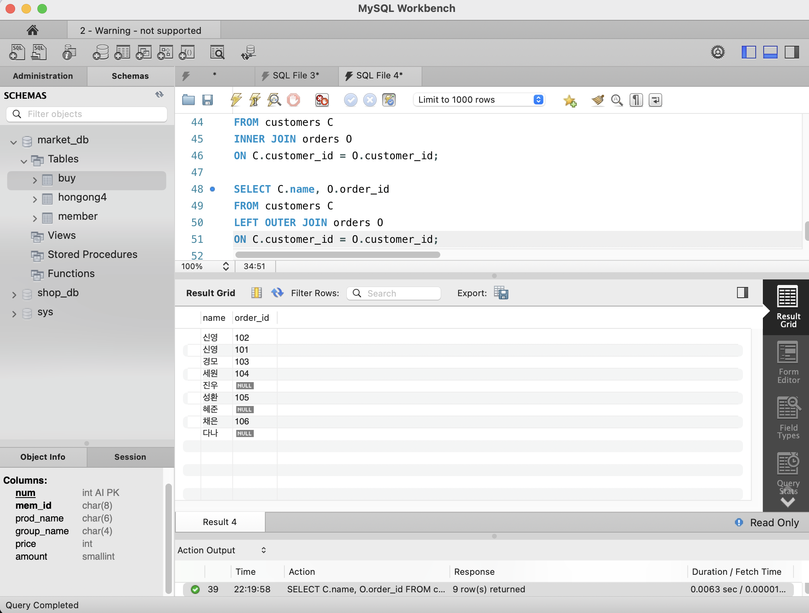
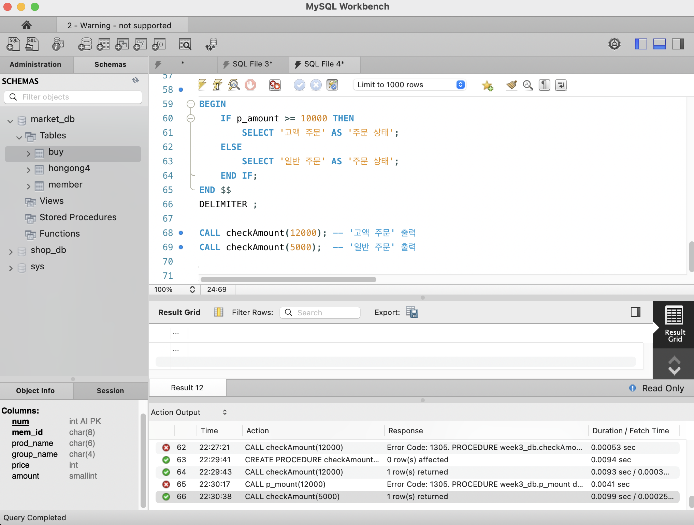


### 🎉 수고하셨습니다.


