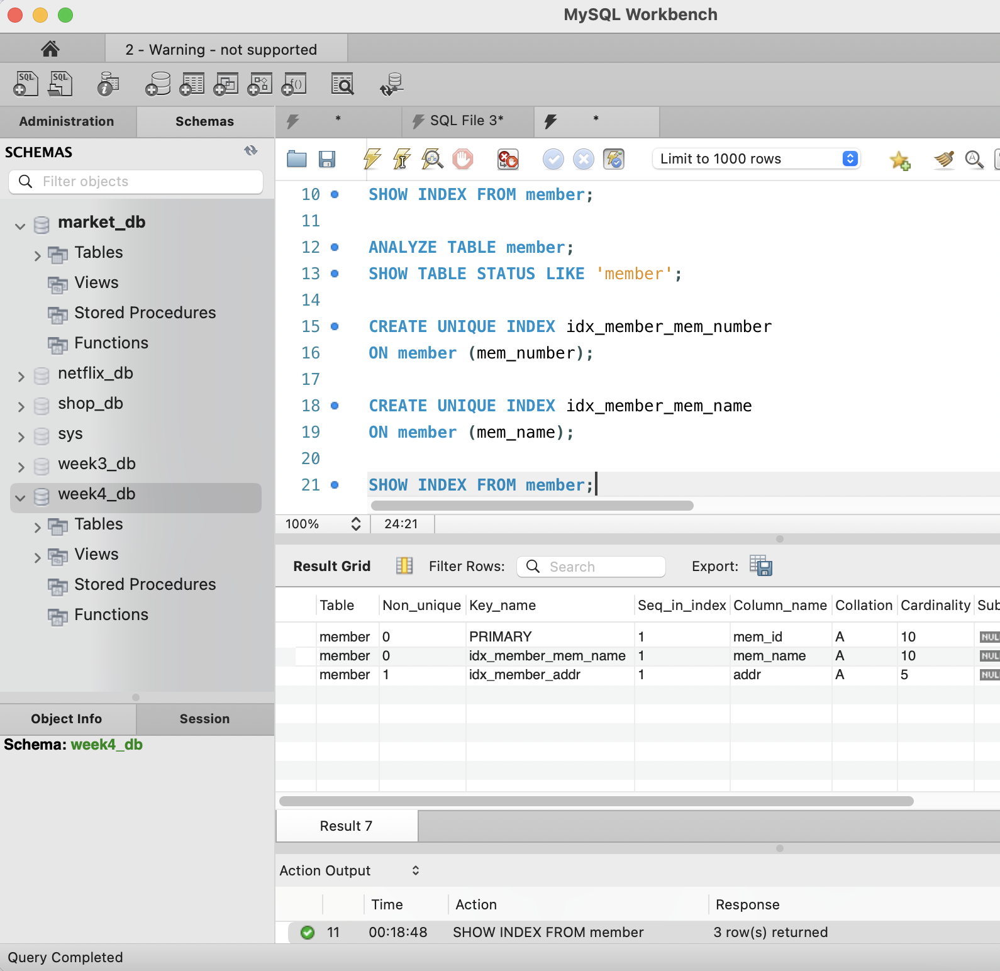
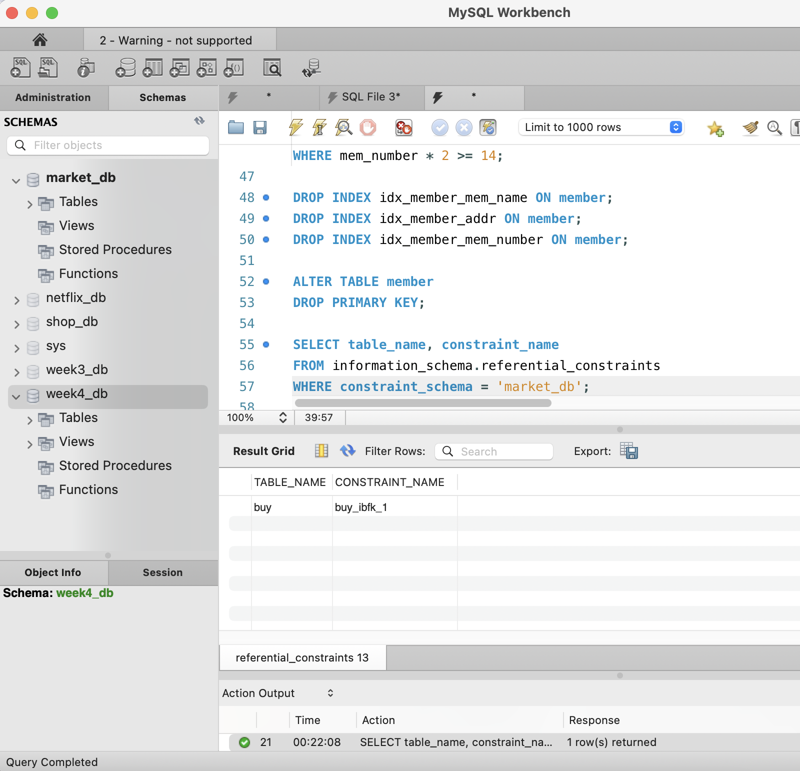
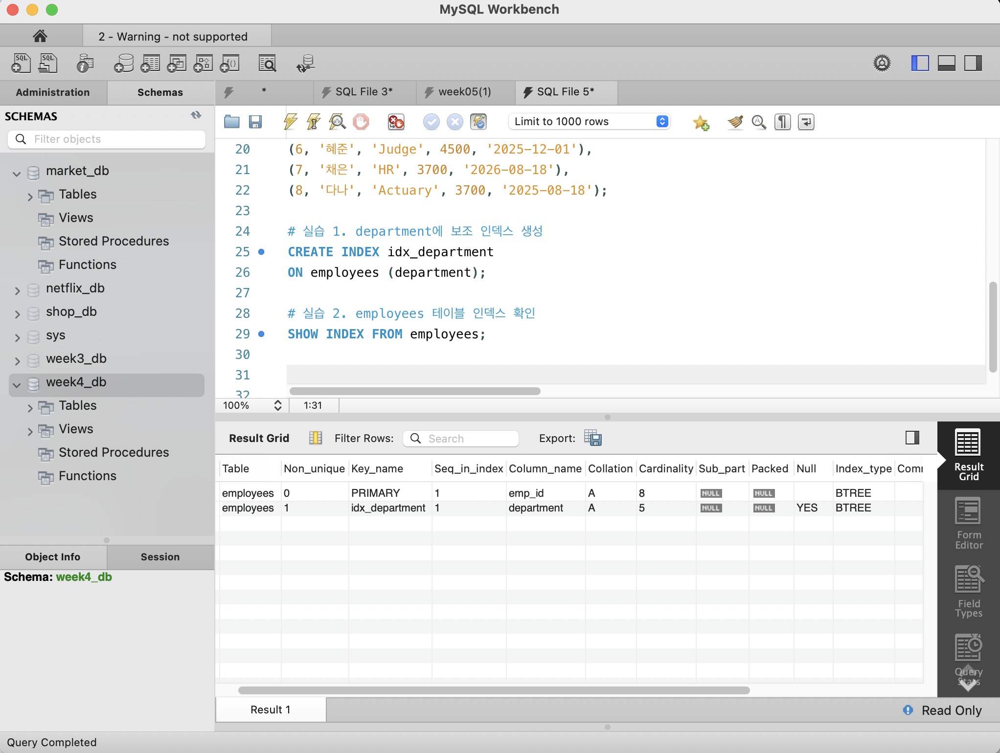
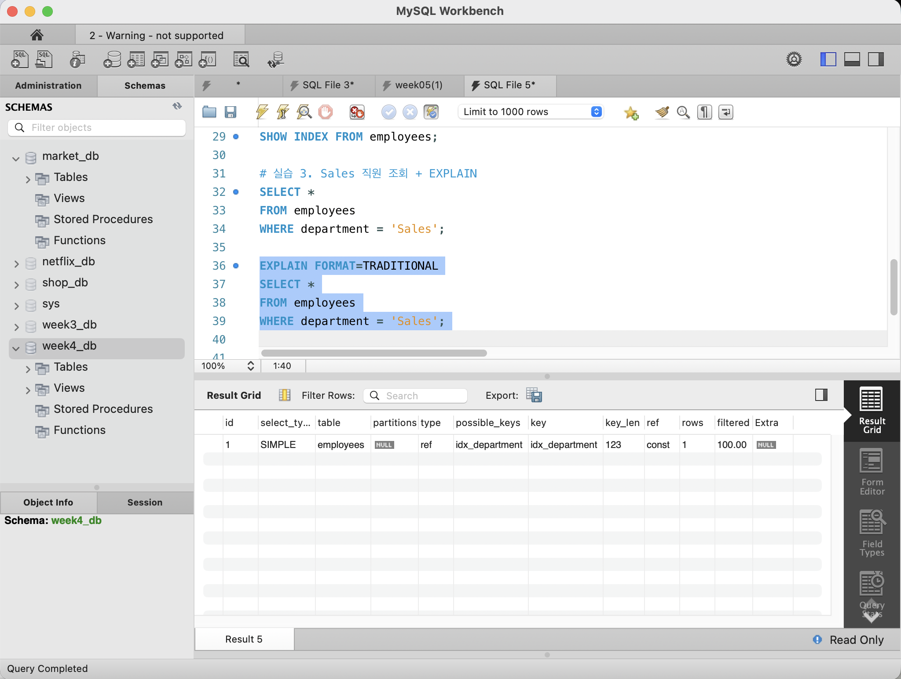
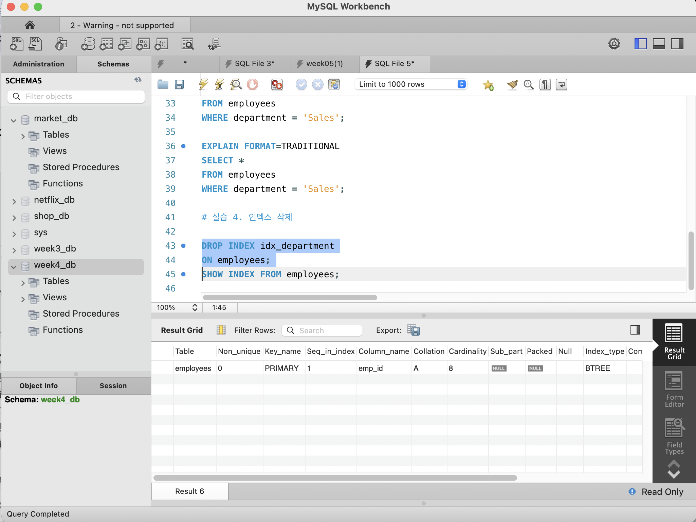

# SQL_ADVANCED 5주차 정규 과제 

📌SQL_ADVANCED 정규과제는 매주 정해진 분량의 『*혼자 공부하는 SQL*』 을 읽고 학습하는 것입니다. 이번주는 아래의 **SQL_ADVANCED_5th_TIL**에 나열된 분량을 읽고 공부하시면 됩니다.

아래의 문제를 풀어보며 학습 내용을 점검하세요. 문제를 해결하는 과정에서 개념을 스스로 정리하고, 필요한 경우 제시된 강의를 참고하여 보완하는 것이 좋습니다.

<!-- 강의 링크는 아래와 같습니다.
https://www.youtube.com/watch?v=KZmW6VaY5BU&list=PLVsNizTWUw7GCfy5RH27cQL5MeKYnl8Pm&index=16
https://www.youtube.com/watch?v=vWTDuoSG-YQ&list=PLVsNizTWUw7GCfy5RH27cQL5MeKYnl8Pm&index=17
https://www.youtube.com/watch?v=aiMSluMNzI8&list=PLVsNizTWUw7GCfy5RH27cQL5MeKYnl8Pm&index=18
-->

**교재 실습 예제 파일은 08_SQL_ADVANCED_Template 레포지토리의 src 폴더에 업로드되어 있습니다. market_db 파일도 해당 폴더에 함께 포함되어 있으니 참고하시기 바랍니다.**

**👀(수행 인증샷은 필수입니다.)** 

## SQL_ADVANCED_5th_TIL

### 6장 인덱스
#### 01. 인덱스 개념을 파악하자
#### 02. 인덱스의 내부 작동
#### 03. 인덱스의 실제 사용  


## Study Schedule

| 주차  | 공부 범위     | 완료 여부 |
| ----- | ------------- | --------- |
| 1주차 | p.24~99    | ✅         |
| 2주차 | p.102~155   | ✅         |
| 3주차 | p.158~213  | ✅         |
| 4주차 | p.216~271 | ✅         |
| 5주차 | p.274~327 | ✅         |
| 6주차 | p.330~369 | 🍽️         |
| 7주차 | p.372~407 | 🍽️         |


<br>

<!-- 여기까진 그대로 둬 주세요-->

---

# 1️⃣ 학습 내용 정리

## 1. 인덱스 개념을 파악하자

### 인덱스(Index)

* **인덱스(Index)**: 데이터를 빠르게 찾을 수 있도록 도와주는 자료구조
* 책의 **찾아보기**와 비슷한 역할
* 인덱스가 없으면 필요한 데이터를 찾기 위해 테이블 전체를 검색해야 함
* 주로 `SELECT`문의 검색 속도를 향상시키기 위해 사용

---

### 인덱스의 장점

* `SELECT`문의 검색 속도가 빨라짐
* 컴퓨터의 부담이 줄어 전체 시스템 성능 향상 가능

### 인덱스의 단점

* 인덱스를 저장하기 위한 추가 공간 필요
* 인덱스 생성 시 시간이 걸릴 수 있음
* `INSERT`, `UPDATE`, `DELETE`가 자주 발생하면 인덱스도 함께 수정되어 성능이 떨어질 수 있음

> 인덱스는 많다고 무조건 좋은 것이 아니라 **필요한 열에 적절하게 생성**해야 함

---

### 인덱스의 종류

MySQL에서 사용하는 대표적인 인덱스는 2가지

#### 1. 클러스터형 인덱스 (Clustered Index)

* 데이터 자체가 **인덱스 기준으로 정렬**됨
* **기본 키(`PRIMARY KEY`)**를 지정하면 자동으로 생성
* 테이블당 **1개만 생성 가능**

#### 2. 보조 인덱스 (Secondary Index)

* 데이터 자체의 순서는 변경되지 않고 **별도의 찾아보기 형태**로 생성
* **고유 키(`UNIQUE`)**를 지정하면 자동으로 생성
* 하나의 테이블에 **여러 개 생성 가능**

---

### 기본 키와 클러스터형 인덱스

```sql
CREATE TABLE table1 (
    col1 INT PRIMARY KEY,
    col2 INT,
    col3 INT
);
```

* `col1`을 `PRIMARY KEY`로 지정
* `col1`에 **클러스터형 인덱스 자동 생성**

인덱스 확인

```sql
SHOW INDEX FROM table1;
```

* **`SHOW INDEX`**: 테이블의 인덱스 정보 확인

---

### SHOW INDEX 주요 항목

* **`Key_name`**: 인덱스 이름
* `PRIMARY` → 기본 키로 생성된 클러스터형 인덱스
* **`Column_name`**: 인덱스가 설정된 열
* **`Non_unique`**
  * `0` → 중복 허용 X
  * `1` → 중복 허용

---

### 고유 키와 보조 인덱스

```sql
CREATE TABLE table2 (
    col1 INT PRIMARY KEY,
    col2 INT UNIQUE,
    col3 INT UNIQUE
);
```

* `col1` → 클러스터형 인덱스
* `col2`, `col3` → 각각 보조 인덱스 생성
* `UNIQUE`는 중복을 허용하지 않으므로 `Non_unique = 0`

---

### 클러스터형 인덱스와 정렬

기본 키가 없는 상태에서는 입력된 순서대로 데이터가 저장됨.

```sql
CREATE TABLE member (
    mem_id CHAR(8),
    mem_name VARCHAR(10),
    mem_number INT,
    addr CHAR(2)
);
```

기본 키 추가

```sql
ALTER TABLE member
    ADD CONSTRAINT
    PRIMARY KEY (mem_id);
```

* `mem_id`에 클러스터형 인덱스 생성
* 데이터가 **`mem_id` 기준으로 정렬**

---

### 기본 키 변경

```sql
ALTER TABLE member DROP PRIMARY KEY;

ALTER TABLE member
    ADD CONSTRAINT
    PRIMARY KEY (mem_name);
```

* 기존 기본 키 제거
* `mem_name`을 새로운 기본 키로 지정
* 클러스터형 인덱스가 `mem_name`에 생성
* 데이터도 **`mem_name` 기준으로 다시 정렬**

---

### 보조 인덱스와 데이터 순서

```sql
ALTER TABLE member
    ADD CONSTRAINT
    UNIQUE (mem_id);
```

* `mem_id`에 보조 인덱스 생성
* **실제 데이터의 순서는 변경되지 않음**

```sql
ALTER TABLE member
    ADD CONSTRAINT
    UNIQUE (mem_name);
```

* 보조 인덱스는 여러 개 생성 가능
* 새로운 데이터가 추가되어도 원본 데이터가 보조 인덱스 기준으로 정렬되지는 않음

---

### 핵심 정리

* **인덱스**: 데이터 검색 속도를 높이는 자료구조
* **클러스터형 인덱스**: 데이터 자체를 정렬
* **보조 인덱스**: 별도의 찾아보기 생성
* **`PRIMARY KEY`** → 클러스터형 인덱스 자동 생성
* **`UNIQUE`** → 보조 인덱스 자동 생성
* 클러스터형 인덱스 → 테이블당 **1개**
* 보조 인덱스 → 테이블당 **여러 개 가능**
* **`SHOW INDEX`** → 인덱스 정보 확인

> **확인문제: 다음은 인덱스 종류와 관련된 설명입니다. 가장 거리가 먼 것을 하나 고르세요.**

보기는 아래와 같습니다.
```
1️⃣ 클러스터형 인덱스는 영어사전과 비슷한 개념입니다.
2️⃣ 보조 인덱스는 일반 책의 찾아보기와 비슷한 개념입니다.
3️⃣ 클러스터형 인덱스는 기본 키를 설정하면 자동 생성됩니다.
4️⃣ 보조 인덱스는 NOT NULL을 설정하면 자동 생성됩니다.
```

```
4️⃣
이유: 보조 인덱스는 NOT NULL을 설정한다고 자동 생성되지 않음
-> 보조 인덱스는 UNIQUE를 설정하면 자동 생성됨
```


## 2. 인덱스의 내부 작동 

## 2. 인덱스의 내부 작동

### 균형 트리(Balanced Tree)

* **균형 트리**: 인덱스 내부에서 사용하는 트리 구조
* 데이터를 빠르게 검색하기 위해 사용
* 구성 요소
  * **루트 노드(Root Node)**: 가장 상위 노드
  * **리프 노드(Leaf Node)**: 가장 아래쪽 노드
  * **중간 노드**: 루트와 리프 사이의 노드

---

### 페이지(Page)

* **페이지(Page)**: MySQL에서 데이터를 저장하는 기본 단위
* 하나의 노드는 하나의 페이지에 해당
* 페이지 크기: **16KB**

---

### 균형 트리를 사용하는 이유

* 데이터가 많아도 필요한 데이터가 있는 위치를 빠르게 찾을 수 있음
* 모든 데이터를 처음부터 끝까지 검색할 필요가 없음

---

### 전체 테이블 검색 (Full Table Scan)

* **Full Table Scan**: 테이블의 처음부터 끝까지 모든 데이터를 검색하는 방식
* 인덱스가 없으면 원하는 데이터를 찾기 위해 여러 페이지를 모두 읽어야 함
* 데이터가 많을수록 검색 속도가 느려짐

---

### 인덱스를 이용한 검색

* 인덱스가 있으면 **루트 페이지 → 리프 페이지** 순서로 필요한 위치를 찾음
* 전체 페이지를 검색하지 않아도 되므로 검색 속도가 빠름

예시

```text
루트 페이지
    ↓
필요한 리프 페이지
    ↓
원하는 데이터
```

---

### 페이지 분할(Page Split)

* **페이지 분할**: 데이터 페이지에 빈 공간이 없을 때 새로운 페이지를 만드는 작업
* 새로운 데이터가 기존 데이터 사이에 들어가야 할 경우 발생 가능
* 기존 데이터를 나누어 새 페이지에 저장

---

### 페이지 분할의 단점

* 페이지 분할 작업 자체에 시간이 필요
* `INSERT`, `UPDATE`, `DELETE` 작업이 많으면 성능이 저하될 수 있음
* 인덱스가 많을수록 데이터 변경 시 관리해야 할 인덱스도 많아짐

> 인덱스는 `SELECT` 속도를 높여주지만 데이터 변경 작업은 느려질 수 있음

---

### 클러스터형 인덱스 구조

* **클러스터형 인덱스**: 데이터 페이지 자체가 인덱스 순서대로 정렬
* `PRIMARY KEY`를 기준으로 생성
* 리프 페이지가 **실제 데이터 페이지**

```sql
ALTER TABLE cluster
    ADD CONSTRAINT
    PRIMARY KEY (mem_id);
```

* `mem_id`를 기준으로 데이터 정렬
* 인덱스의 리프 페이지에 실제 데이터가 저장됨

---

### 클러스터형 인덱스 검색

* 루트 페이지에서 찾을 값이 들어 있는 리프 페이지 확인
* 해당 리프 페이지로 이동
* 리프 페이지에서 원하는 데이터 검색

```text
루트 페이지
    ↓
리프 페이지 = 데이터 페이지
    ↓
데이터 검색
```

* 비교적 적은 페이지를 읽기 때문에 검색 속도가 빠름

---

### 보조 인덱스 구조

* **보조 인덱스**: 실제 데이터와 별도로 인덱스 페이지 생성
* 리프 페이지에 실제 데이터가 아닌 **데이터의 위치 정보** 저장
* 데이터 자체의 정렬 순서는 변경되지 않음

```sql
ALTER TABLE second
    ADD CONSTRAINT
    UNIQUE (mem_id);
```

* `UNIQUE` 지정 → 보조 인덱스 생성

---

### 보조 인덱스의 리프 페이지

* 보조 인덱스의 리프 페이지에는
  * 인덱스 값
  * 실제 데이터의 위치 정보

가 저장됨

```text
인덱스 페이지
    ↓
데이터 위치 확인
    ↓
실제 데이터 페이지 이동
    ↓
데이터 검색
```

---

### 클러스터형 인덱스 vs 보조 인덱스 검색

#### 클러스터형 인덱스

* 루트 페이지 → 리프 페이지
* 리프 페이지에 **실제 데이터 존재**
* 상대적으로 적은 페이지를 읽음

#### 보조 인덱스

* 루트 페이지 → 리프 페이지
* 리프 페이지에서 실제 데이터 위치 확인
* 다시 데이터 페이지로 이동
* 클러스터형 인덱스보다 추가 페이지를 읽을 수 있음

---

### 핵심 정리

* **균형 트리**: 인덱스가 내부적으로 사용하는 트리 구조
* **루트 노드**: 트리의 가장 위쪽
* **리프 노드**: 트리의 가장 아래쪽
* **페이지**: MySQL의 데이터 저장 기본 단위, `16KB`
* **Full Table Scan**: 전체 테이블을 처음부터 끝까지 검색
* **페이지 분할**: 페이지 공간 부족 시 새로운 페이지를 생성하는 작업
* **클러스터형 인덱스**: 리프 페이지에 실제 데이터 저장
* **보조 인덱스**: 리프 페이지에 실제 데이터의 위치 정보 저장
* 인덱스 → `SELECT` 속도 향상
* 인덱스가 많으면 → `INSERT`, `UPDATE`, `DELETE` 성능 저하 가능

> **확인문제: 다음 설명에서 빈칸에 공통으로 들어갈 용어를 쓰시오.**

```
인덱스를 구성하게 되면 데이터의 변경 작업(INSERT, UPDATE, DELETE)시에 성능이 나빠지는 단점이 있습니다.  
특히 INSERT 작업이 일어날 때 더 느리게 입력될 수 있는데요, 이유는 (           ) 이라는 작업이 발생하기 때문입니다.  
(            ) 작업이 일어나면 MySQL이 느려지고 너무 자주 일어나면 성능에 큰 영향을 줍니다.
```

```
페이지 분할

인덱스를 구성하게 되면 데이터 변경 작업(`INSERT`, `UPDATE`, `DELETE`) 시 성능이 나빠질 수 있음
    -> 특히 `INSERT` 작업이 일어날 때 더 느리게 입력될 수 있는데, 페이지 분할 작업이 일어나기 때문임 
```


## 3. 인덱스의 실제 사용 




### 1. 인덱스 생성

- 인덱스 생성 → `CREATE INDEX`
- 기본 형태

```sql
CREATE INDEX 인덱스명
ON 테이블명 (열이름);
```

- 일반 인덱스 → **중복 허용**
- UNIQUE 인덱스 → **중복 허용 X**

```sql
CREATE UNIQUE INDEX 인덱스명
ON 테이블명 (열이름);
```

#### 정렬 방향

- `ASC` → 오름차순
- `DESC` → 내림차순
- 기본값 → `ASC`

```sql
CREATE INDEX 인덱스명
ON 테이블명 (열이름 DESC);
```

---

### 2. 인덱스 제거

- 일반/보조 인덱스 제거 → `DROP INDEX`

```sql
DROP INDEX 인덱스명
ON 테이블명;
```

- `PRIMARY KEY`로 생성된 인덱스 → `DROP INDEX` 사용 X
- 기본 키 자체를 제거

```sql
ALTER TABLE 테이블명
DROP PRIMARY KEY;
```

---

### 3. 인덱스 확인

#### 생성된 인덱스 확인

```sql
SHOW INDEX FROM 테이블명;
```

#### 주요 항목

- `Key_name` → 인덱스 이름
- `Column_name` → 인덱스가 설정된 열
- `Non_unique = 0` → 중복 허용 X
- `Non_unique = 1` → 중복 허용
- `PRIMARY` → 기본 키로 생성된 인덱스

---

### 4. 인덱스 크기 확인

```sql
SHOW TABLE STATUS LIKE '테이블명';
```

#### 주요 항목

- `Data_length` → 데이터 크기
- `Index_length` → 인덱스 크기

#### 인덱스 정보 갱신

```sql
ANALYZE TABLE 테이블명;
```

- 생성한 인덱스 정보를 실제 테이블에 반영/갱신

---

### 5. 단순 보조 인덱스

- 일반 `CREATE INDEX`로 생성
- 중복값 허용
- 하나의 테이블에 여러 개 생성 가능

```sql
CREATE INDEX idx_member_addr
ON member (addr);
```

> `addr`에 서울, 경기 같은 값이 여러 번 있어도 가능

---

### 6. 고유 보조 인덱스

- `UNIQUE` 사용
- 중복값 허용 X

```sql
CREATE UNIQUE INDEX idx_member_mem_name
ON member (mem_name);
```

#### 특징

- 중복 데이터가 이미 존재 → 생성 불가
- 생성 후 중복 데이터 입력 → 오류

#### 사용 예

- 학번
- 이메일
- 주민등록번호
- 사번

---

### 7. 인덱스와 SELECT

#### 전체 데이터 조회

```sql
SELECT *
FROM member;
```

- 모든 행이 필요
- 인덱스 사용 필요성 낮음
- `Full Table Scan` 발생 가능

#### Full Table Scan

> 테이블 전체를 처음부터 끝까지 검색

---

### 8. 인덱스가 있는 열 검색

```sql
SELECT mem_id, mem_name, addr
FROM member
WHERE mem_name = '에이핑크';
```

- `mem_name`에 인덱스 존재
- 빠르게 원하는 데이터 검색 가능

#### 핵심

> `WHERE` 조건에 자주 사용되는 열에 인덱스를 생성하면 검색 속도가 빨라질 수 있음

---

### 9. 범위 검색

```sql
SELECT mem_name, mem_number
FROM member
WHERE mem_number >= 7;
```

- 인덱스 범위만 탐색
- `Index Range Scan` 사용 가능

#### Index Range Scan

> 인덱스에서 필요한 범위만 검색

---

### 10. 인덱스가 있어도 사용하지 않는 경우

```sql
SELECT mem_name, mem_number
FROM member
WHERE mem_number >= 1;
```

- 거의 모든 데이터가 조건에 포함됨
- MySQL이 전체 검색이 더 빠르다고 판단할 수 있음
- `Full Table Scan` 사용 가능

#### 핵심

> 인덱스가 존재한다고 항상 인덱스를 사용하는 것은 아님

---

### 11. 열에 연산 사용

#### 좋지 않은 형태

```sql
WHERE mem_number * 2 >= 14;
```

- 인덱스가 설정된 열 자체에 연산 수행
- 인덱스를 사용하지 않을 수 있음

### 좋은 형태

```sql
WHERE mem_number >= 14 / 2;
```

#### 핵심

> 가능하면 인덱스가 설정된 열 자체에는 연산하지 않는 것이 좋음

---

### 12. 인덱스 생성의 단점

인덱스 생성 시 다음 작업은 느려질 수 있음.

- `INSERT`
- `UPDATE`
- `DELETE`

#### 이유

> 데이터가 변경될 때 인덱스도 함께 수정해야 하기 때문

---

### 13. 페이지 분할

- 인덱스에 새 데이터가 들어갈 공간이 부족할 때 발생
- 기존 페이지를 나누고 새로운 페이지 생성
- 데이터 이동 발생
- INSERT 성능 저하

#### 핵심

> 인덱스가 많으면 데이터 변경 작업의 부담이 증가

---

### 14. 인덱스를 만들기 좋은 열

#### 효과적인 경우

- `WHERE`절에서 자주 검색하는 열
- 중복값이 적은 열
- 서로 다른 값이 많은 열

예:

```text
회원 아이디
이메일
학번
상품번호
```

---

### 15. 인덱스 효과가 적은 열

중복 데이터가 많은 열은 효과가 적을 수 있음.

예:

```text
성별
학년
지역 구분
교통수단
```

#### 이유

> 하나의 값을 검색해도 많은 행이 동시에 검색되기 때문

---

### 16. 클러스터형 인덱스

- 기본 키 지정 시 자동 생성
- 실제 데이터가 인덱스 기준으로 정렬
- 테이블당 **1개만 생성 가능**

#### 핵심

```text
PRIMARY KEY
→ 클러스터형 인덱스 자동 생성
```

---

### 17. 보조 인덱스

- 기본 키 외에 생성되는 인덱스
- 데이터 자체의 순서는 바뀌지 않음
- 여러 개 생성 가능

#### 구조

```text
보조 인덱스
→ 인덱스 값
→ 실제 데이터 위치
```

---

### 18. 사용하지 않는 인덱스

사용하지 않는 인덱스는 제거하는 것이 좋음.

#### 이유

- 저장 공간 사용
- INSERT 성능 저하
- UPDATE 성능 저하
- DELETE 성능 저하

---

### 핵심 정리

```text
CREATE INDEX
→ 일반 인덱스 생성

CREATE UNIQUE INDEX
→ 중복 불가 인덱스 생성

DROP INDEX
→ 보조 인덱스 제거

SHOW INDEX
→ 인덱스 확인

SHOW TABLE STATUS
→ 인덱스 크기 확인

ANALYZE TABLE
→ 인덱스 정보 갱신

Full Table Scan
→ 전체 테이블 검색

Index Range Scan
→ 인덱스의 일정 범위 검색

PRIMARY KEY
→ 클러스터형 인덱스 자동 생성
```

---

# 2️⃣ 실습과제

## 1. 데이터베이스 구축

아래 코드를 MySQL Workbench에 붙여넣은 후,  
**전체 드래그 → 실행 (Ctrl + Shift + Enter)** 하여 데이터베이스를 생성하세요.

```sql
CREATE DATABASE IF NOT EXISTS week5_db;
USE week5_db;

DROP TABLE IF EXISTS employees;

CREATE TABLE employees (
    emp_id INT PRIMARY KEY,
    name VARCHAR(20),
    department VARCHAR(30),
    salary INT,
    hire_date DATE
);

INSERT INTO employees VALUES
(1, '신영', 'Marketing', 3500, '2026-03-01'),
(2, '경모', 'HR', 3200, '2026-06-15'),
(3, '세원', 'IT', 4000, '2024-09-10'),
(4, '진우', 'HR', 5000, '2024-01-20'),
(5, '성환', 'Actuary', 3800, '2025-04-01'),
(6, '혜준', 'Judge', 4500, '2025-12-01'),
(7, '채은', 'HR', 3700, '2026-08-18'),
(8, '다나', 'Actuary', 3700, '2025-08-18');
```

## 2. 실습 문제

다음 문제를 수행하고 실행 결과를 캡처하여 제출하세요.

1. department 컬럼에 보조 인덱스를 생성하시오.
    - 인덱스 생성 후, `SHOW INDEX FROM employees;` 실행 결과가 보이도록 캡처합니다.
    - (idx_department 인덱스가 존재하는지 확인되어야 합니다.)
2. employees 테이블의 인덱스를 확인하시오.
3. department가 'Sales'인 직원을 조회하시오.
   - 'Sales' 조회 시, 반드시 `EXPLAIN`을 함께 실행한 화면을 캡처합니다.
   - (key 컬럼에 idx_department가 표시되어야 합니다.)
4. 생성한 인덱스를 삭제하시오.
   - 인덱스 삭제 후, 다시 `SHOW INDEX FROM employees;`를 실행하여 idx_department가 사라진 것을 확인한 화면을 캡처합니다.

## 3. 제출방법

인덱스 생성 결과, EXPLAIN 실행 결과, 인덱스 삭제 결과가 모두 보이도록 캡처하여 제출하세요.





### 🎉 수고하셨습니다.


